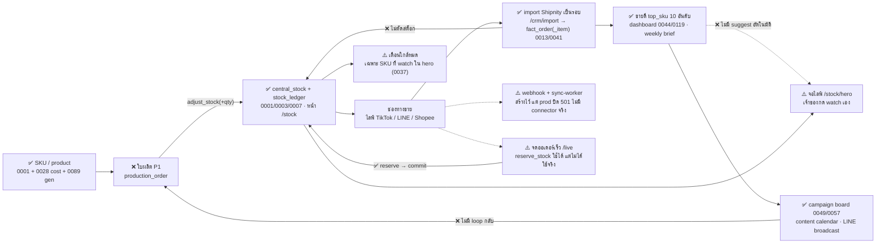

# วงจรระบบ 3J — จาก SKU ถึงยอดขาย แล้วกลับมาผลิต (สถานะ 17 ก.ย. 69)

> เอกสารตอบคำถามเจ้าของก่อนอนุมัติ P1 (ใบผลิตเข้าสต็อก): "ตัวไหน link กับตัวไหน วิ่งไปยังไงต่อ"
> ทุกลิงก์ติดป้ายจากโค้ดจริง — ✅ มีแล้ว · ⚠️ มีบางส่วน · ❌ ยังไม่มี · ห้ามอ่านว่า "ระบบทำอยู่แล้ว" ถ้าป้ายไม่ใช่ ✅
> อ้างอิง: `supabase/migrations/*`, `lib/actions/*`, `lib/import/*`, `app/(dashboard)/*`

## 0. ภาพรวม

> **ตัวเลขจริงบน DB 17 ก.ย. 69 (Tech Lead query)**: SKU active 286 · `central_stock` มีแค่ **2 SKU รวม 14 ชิ้น** · `stock_ledger` **0 แถว** (ไม่เคยมีรายการเคลื่อนไหวเลย) · `hero_watch` **0 SKU** — ยืนยันว่าสายสต็อก/จอไลฟ์ยัง**ไม่ถูกใช้งานจริง** ทุกอย่างด้านล่างที่ติด ✅ คือ "เครื่องมือมี" ไม่ใช่ "มีข้อมูลวิ่งอยู่"

ระบบมี **สองสายที่ยังไม่เชื่อมกัน**: (ก) สาย OMS (0001–0008) — `public.product` / `central_stock` / `stock_ledger` /
`public.orders` + RPC `reserve/commit/release/adjust_stock` ออกแบบมากัน oversell แบบ real-time แต่ **ออเดอร์จริงไม่ได้วิ่งผ่านสายนี้**
(`public.orders` ว่าง · webhook ปิดตาย 501 บน prod · ไม่มี connector จริง) และ (ข) สาย Analytics (0010–0121) — ยอดขายจริง
ทั้งหมดมาจาก **import ไฟล์ Shipnity เป็นรอบ** ที่ `/crm/import` ลง `analytics.fact_order` + `fact_order_item` แล้วต่อยอดเป็น
dashboard / RFM / hero / campaign board **สาย (ข) ไม่แตะ `central_stock` เลย** — นี่คือช่องว่างใหญ่ที่สุดของวงจร:
ขายได้แล้วสต็อกไม่ขยับ ⇒ ทุกอย่างที่อิงสต็อก (เตือนใกล้หมด, จอ hero) ยังไม่มีตัวเลขจริงป้อน

## 1. ขายได้แล้ว ตัดสต็อกยังไง

**วันนี้เป็นแบบนี้**
- ✅ เครื่องมือตัดสต็อกมีครบและแน่น: `reserve_stock` / `commit_stock` / `release_stock` / `adjust_stock` (0003/0005/0006/0007)
  atomic UPDATE + CHECK `qty_reserved <= qty_on_hand` + ledger idempotent — ผ่าน concurrent test แล้ว
- ✅ ใครเรียกบ้าง: `lib/actions/quick-order.ts:197` (`reserve_stock` ตอนจดออเดอร์ที่ `/live`) ·
  `lib/actions/orders.ts:342/395` (`commit_stock` ตอนส่ง / `release_stock` ตอนยกเลิก บนหน้า `/orders`) ·
  `lib/actions/stock.ts:91` (`adjust_stock` ปรับมือหน้า `/stock`)
- ❌ **แต่ทางที่ออเดอร์จริงเข้ามา (import) ไม่ตัดสต็อก** — ยืนยันจาก grep: ไม่มี `adjust_stock`/`reserve_stock` ใน 0041
  (`transform_pending_order_lines`) หรือ 0013/0016 (`transform_pending_orders`) และไม่มีใน `lib/actions/import-*.ts`
  import ทำแค่ match SKU → `v_dim_product` เพื่อล็อกต้นทุน (0041:267) แล้วเขียน `fact_order_item` จบ
- ⚠️ webhook `app/api/webhooks/[channel]/route.ts`: prod = ปฏิเสธทุก request (501) โดยตั้งใจ (go-live gate G-1/G-2) ·
  `packages/connectors/registry.ts` มีแต่ `mock.ts` — **TikTok/Shopee ยังไม่ต่อ ไม่มีใครเรียกจริง** ·
  `supabase/functions/sync-worker` มีโค้ด แต่ไม่มี `cron.schedule` เรียกมันใน migrations (0003/0024 เป็น cron เรื่องอื่น)
- ผลรวม: `public.orders` ว่าง ⇒ `central_stock.qty_reserved` ไม่เคยขยับจากการขายจริง ⇒ ตัวเลขสต็อกในระบบ = ค่าที่ปรับมือเท่านั้น

**ช่องที่ขาด**: ไม่มีสะพานจาก `fact_order_item` (ขายจริง, ย้อนหลัง) → `central_stock` (นับชิ้น, ปัจจุบัน)

**เสนอ (P1.5 — เล็ก-กลาง, ทำหลัง P1)**: RPC `analytics.stock_apply_import_batch(p_batch_id)` วนทุก `fact_order_item` ใน batch ที่
match product แล้ว → `adjust_stock(-qty, idem_key = imp:<fact_order_item.id>)` — idempotent ตาม key แถว ⇒ re-import ซ้ำไม่ตัดซ้ำ ·
รายการที่ tombstone/ยกเลิก (0112–0115) → `adjust_stock(+qty, imp-rev:<id>)` · **ไม่ใช้ reserve/commit** เพราะ import คือ
ของที่ส่งไปแล้ว (past tense) ไม่มีสถานะรอจ่าย · ต้องกัน 2 อย่างก่อน: (1) SKU ไม่ match (unknown) = ข้ามพร้อมนับรายงาน
(2) live-SKU เป็นกรัม ไม่ใช่ชิ้น — ต้องแยกกฎ (ดู §8 ข้อ 1)
ทางเลือกที่ตัดทิ้ง: ต่อ webhook TikTok จริง — ใหญ่กว่ามาก (credential + HMAC + connector) และ import ยังเป็น source of truth อยู่ดี

## 2. ของใกล้หมด/หมด แจ้งบอกยังไง

**วันนี้เป็นแบบนี้**
- ⚠️ มีเฉพาะ SKU ที่เจ้าของกด watch: `analytics.hero_watch.low_stock_threshold` (default 3) → `v_hero_stock.is_low / is_out`
  (0037) → แสดงบนจอ `/stock/hero` และนับรวมเป็นตัวเลข `low_stock` ใน `dashboard_summary` (0039:37)
- ❌ SKU ทั่วไปที่ไม่ได้ watch: ไม่มี threshold ใน `product`/`central_stock` (grep `reorder_point/safety_stock` = ไม่มี) · ไม่มี notification
  (LINE/email/push) — "แจ้ง" = ต้องเปิดหน้าดูเอง
- ⚠️ `v_sku_order_alert` (0031, `lib/actions/catalog.ts:441`) **ไม่ใช่เตือนสต็อก** — เตือน "SKU ที่ขายได้แต่ไม่รู้จัก (unknown) หรือ
  ปิด is_active แล้วยังมีออเดอร์" แสดงที่หน้า `/catalog` ใช้จับ SKU หลุด catalog หลัง import
- และเพราะ §1 สต็อกไม่ถูกตัดจากการขาย ⇒ `is_low` วันนี้ยังเชื่อไม่ได้แม้ใน SKU ที่ watch

**ช่องที่ขาด**: threshold ระดับ SKU + ช่องทางแจ้ง + ข้อมูลสต็อกที่สดจริง (พึ่ง §1)

**เสนอ (P3 — เล็ก)**: เพิ่ม `product.reorder_point int` (null = ไม่เตือน) + view `v_stock_alert` (available <= reorder_point) → การ์ดบน
`/dashboard` + แถวใน Weekly Brief · ช่อง push จริง (LINE Notify) เลื่อนไปจนกว่า §1 ทำเสร็จ ไม่งั้นเตือนเท็จทั้งวัน

## 3. บันทึกรายการขายดี ยังไง

**วันนี้เป็นแบบนี้**
- ✅ `top_sku` 10 อันดับตาม revenue ใน RPC dashboard (0044 → 0119 `trend_split`) แสดงหน้า `/dashboard` เลือกช่วง/ช่องทางได้
  (0054) — คำนวณสดจาก `fact_order_item` ทุกครั้ง ไม่ได้ "บันทึก" เป็นตาราง
- ✅ `v_product_affinity` (0099) จัดกลุ่ม bar/jewelry/neutral ต่อ SKU — ใช้แยกฐานลูกค้า ไม่ใช่จัดอันดับขายดี
- ⚠️ Weekly Brief (`marketing/weekly-brief/`) ดึง top 10 ด้วย SQL มือทุกจันทร์ + กฎ live-SKU (regex `^live` บน `sku_snapshot` แบบเดียวกับ
  `v_live_night` 0121:258) — ไม่มี view กลางให้หน้าอื่นเรียกซ้ำ
- ❌ ไม่มีนิยาม "ขายดี" ที่ตกลงกัน (7 วัน? 30 วัน? นับชิ้นหรือบาท? ตัดเงินแท่ง/live-SKU ออกไหม) และไม่มี snapshot รายสัปดาห์เก็บไว้ดูย้อน

**เสนอ (P4a — เล็ก)**: view `analytics.v_sku_velocity` (ต่อ SKU: qty/revenue 7 วัน, 30 วัน, 90 วัน + rank + affinity_group + ธง live-SKU)
เป็น view เดียวที่ dashboard / hero suggest / weekly brief ใช้ร่วม — จบปัญหา "SQL มือ 3 ที่ตอบไม่ตรงกัน"

## 4. Suggest ไป product hero (`/stock/hero`) ยังไง

**วันนี้เป็นแบบนี้**
- ✅ จอ `/stock/hero` แสดง available (on_hand − reserved) + threshold ต่อ SKU ที่อยู่ใน `hero_watch` · หน้าสาธารณะไม่ต้อง login
  (ยกเว้น AUTH_GATE โดยตั้งใจ) · เขียนได้เฉพาะ owner/admin ผ่าน `hero_watch_add/remove`
- ❌ **ไม่มี "แนะนำ" อัตโนมัติ** — grep `suggest/แนะนำ` ใน `lib/actions/hero-stock.ts` + `app/(dashboard)/stock/hero` = 0 ผลลัพธ์
  เจ้าของเลือกจาก product picker แล้วกด watch เอง
- และตัวเลขบนจอยังไม่ใช่สต็อกจริง (ดู §1) — วันนี้จอ hero เป็น "ตัวนับที่ต้องปรับมือ" ไม่ใช่ "ตัวนับสด"

**เสนอ (P4b — เล็ก, ต่อจาก P4a)**: บน `/stock/hero` (โหมด admin) เพิ่มแถบ "ขายดี 7 วันที่ยังไม่ watch" จาก `v_sku_velocity`
กดเพิ่มได้ทีละตัว — **เสนอ ไม่ auto-add** เพราะของที่จะเชียร์ในไลฟ์คืนนี้เป็นการตัดสินใจของคนไลฟ์ (มีของจริงในมือไหม, จับคู่โปรไหม)
และ hero 3–5 ตัวคือข้อจำกัดของจอไลฟ์ ระบบไม่ควรสลับให้เองกลางคืน

## 5. นำไปทำ promotion / content / ads ต่อยังไง

**วันนี้เป็นแบบนี้**
- ✅ Campaign board `analytics.campaign/campaign_step/step_artifact/step_gate` (0049) + content calendar (0057) → หน้า
  `/marketing/copilot` และ `/marketing/calendar` · แผน ต.ค. 69 ลง board แล้ว · เอกสารที่ `marketing/content-calendar/2026-10.md`
- ✅ Audience builder `/marketing/audience` (`v_audience` 0033/0099 RFM + affinity) → LINE broadcast (กติกา ≤4 ครั้ง/28 วัน)
- ✅ Weekly Brief ทุกจันทร์ (scheduled task) รวม top 10 + live-SKU + ข้อเสนอลง `recommendation_log`
- ✅ `live_session_log` (0121) จด 1 บรรทัด/คืน → `v_live_night` ยอด/ชม.ไลฟ์ + live-SKU orders/revenue
- ❌ **Ads = NO-GO ตามมติเจ้าของ** (organic 100%; `fact_ad_spend` ฿500 คือรายการทดลอง) — หน้า `/marketing/ad-spend` มีแต่ไม่ใช่ทางไป
- ❌ ไม่มีลิงก์ข้อมูล "SKU ขายดี → step ใน campaign" — วันนี้ CMO/Tech Lead ยกตัวเลขจาก brief ไปใส่ brief ของ copywriter ด้วยมือ
  (ซึ่งตรงกับกติกา: ตัวเลขภายในห้ามเข้า brief copy สาธารณะ — การ "ต่อท่อ" ต้องผ่านคนกรองอยู่ดี)

**เสนอ (P5 — เล็ก, ไม่เร่ง)**: ใน `campaign_step` เพิ่ม `featured_product_ids uuid[]` ให้ step ผูก SKU ที่จะเชียร์ →
Weekly Brief รายงาน "SKU ที่แคมเปญเชียร์ ขายขึ้นไหม" อัตโนมัติ · **ไม่สร้าง ads pipeline** ตามมติ

## 6. ใบผลิตเข้าสต็อก (P1) อยู่ตรงไหนของวงจร

- P1 คือ **ขาเข้า** ของ `central_stock` ตัวแรกที่ไม่ใช่การปรับมือ: `production_order(+item)` → done →
  update `product` (spot weight + labor สำหรับ cost_mode spot ตาม 0028) + `adjust_stock(+qty_done, idem_key = po:<item_id>)`
- ✅ ต่อกับของที่มีแล้วครบ: SKU generator 0089 (`/catalog/sku-prefix`), `product.silver_weight_g/category` 0028, `adjust_stock` 0007
  (signed-delta idempotent — ผ่านกับดักข้อ "compare signed delta" แล้ว)
- ⚠️ แต่ P1 ทำให้เฉพาะ**ขาเข้า**สด — ถ้าขาออก (§1) ยังไม่ตัด สต็อกจะ "บวกอย่างเดียว" แล้ว `is_low` ไม่มีวันขึ้น ⇒ P1 ต้องตามด้วย P1.5 ในรอบถัดไป
  ไม่งั้นเจ้าของจะเห็นตัวเลขที่ดูเหมือนจริงแต่ผิด (แย่กว่าไม่มี)
- P2 variant (`parent_product_id` + `variant_attrs {size, stone_color}`; ไซส์เต็ม+freesize · สีพลอย free text · SKU เก่า 301 ปล่อย)
  = แถวลูกใน `product` ⇒ `central_stock` นับต่อ variant อัตโนมัติ · ใบผลิตต้องระบุ variant ต่อ item · แต่ import Shipnity match ที่
  `sku` ตัวเดียว (0041:268, 0093/0094) ⇒ variant ต้องมี SKU ของตัวเองที่ตรงกับที่กรอกใน Shipnity ไม่งั้นตัดสต็อกลง parent ไม่ได้

## 7. ลำดับงานที่แนะนำ

| ลำดับ | งาน | ขนาด | ทำไมตอนนี้ | ต้องถามเจ้าของ |
|---|---|---|---|---|
| 1 | **P1 ใบผลิต** (design อนุมัติแล้ว) | กลาง | ขาเข้าสต็อกตัวแรก ปลดล็อกทุกอย่างที่อิง `central_stock` | — |
| 2 | **P1.5 ตัดสต็อกจาก import** (`stock_apply_import_batch`) | เล็ก-กลาง | ไม่มีอันนี้ = สต็อกบวกอย่างเดียว P1 ให้ตัวเลขผิด | ข้อ 1, 2 |
| 3 | **ตั้งต้นสต็อกจริง** (นับของ 1 รอบ → `adjust_stock` ตั้งค่า) | ops ไม่ใช่โค้ด | ledger เริ่มจาก 0 ที่ไม่ตรงของจริง ตัดไปก็ติดลบ | ข้อ 3 |
| 4 | **P4a `v_sku_velocity`** view กลางขายดี | เล็ก | แทน SQL มือ 3 ที่ · ต้นทางของ hero suggest + brief | ข้อ 4 |
| 5 | **P3 เตือนใกล้หมด** (`reorder_point` + `v_stock_alert` บน dashboard/brief) | เล็ก | ต้องมี 2+3 ก่อน ไม่งั้นเตือนเท็จ | ข้อ 5 |
| 6 | **P4b hero suggest** (แถบเสนอ กดเพิ่มเอง) | เล็ก | ต่อจาก 4 | — |
| 7 | **P2 variant** | กลาง | ทำหลัง 2 เพราะต้องรู้ก่อนว่า Shipnity กรอก SKU variant ยังไง | ข้อ 6 |
| 8 | P5 ผูก SKU กับ campaign step | เล็ก | ไม่เร่ง — วันนี้คนกรองตัวเลขอยู่แล้ว | — |
| — | webhook/connector จริง | ใหญ่ | **ไม่แนะนำตอนนี้** — import ยังเป็น source of truth, credential ยังไม่มี | — |

## 8. คำถามที่เจ้าของต้องตอบ (≤6)

1. **live-SKU (`live<กรัม>` / `LiveS<กรัม>`) นับสต็อกยังไง?** เป็นกรัมจากกองเดียวกัน (ต้องมี "สต็อกเงินเป็นกรัม" อีกหน่วย)
   หรือไม่นับสต็อกเลย (ตัดจากใบผลิตไม่ได้เพราะไม่ใช่ชิ้นสำเร็จ)? — กำหนดว่า P1.5 ข้ามหรือแปลง
2. **re-import ไฟล์เดือนเดิม** (ออเดอร์สะสมข้ามวัน / ค่าแก้) ให้ตัดสต็อกเฉพาะรายการใหม่ใช่ไหม — และรายการที่หายจากไฟล์ (ยกเลิก) ให้คืนสต็อกอัตโนมัติหรือรอคนกด
3. **นับของจริงตั้งต้นได้เมื่อไหร่ กี่ SKU** — ทั้ง 301 หรือเฉพาะที่ยังขายอยู่? (ledger ที่ไม่ตั้งต้น = ตัวเลขติดลบทันทีที่ตัด)
4. **นิยาม "ขายดี"**: หน้าต่าง 7 หรือ 30 วัน · วัดชิ้นหรือบาท · ตัดเงินแท่ง (แพงต่อชิ้น บิดอันดับ) และ live-SKU ออกจากอันดับไหม
5. **เกณฑ์ใกล้หมด**: ตัวเลขเดียวทั้งร้าน (เช่น ≤3) หรือต่อ SKU · อยากให้เตือนที่ไหน (หน้า dashboard พอ / LINE)
6. **variant กับ Shipnity**: ตอนคีย์ขายจริง SKU ที่กรอกคือของ parent หรือของ variant (มีไซส์/สี)? — ตัดสินว่า variant ต้องมี SKU แยกไหม
