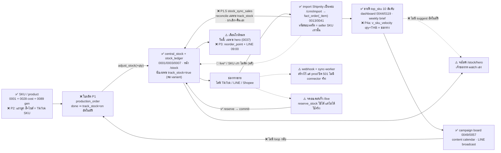

# วงจรระบบ 3J — จาก SKU ถึงยอดขาย แล้วกลับมาผลิต (สถานะ 17 ก.ย. 69 + มติเจ้าของ)

> เอกสารตอบคำถามเจ้าของก่อนอนุมัติ P1 (ใบผลิตเข้าสต็อก): "ตัวไหน link กับตัวไหน วิ่งไปยังไงต่อ"
> ทุกลิงก์ติดป้ายจากโค้ดจริง — ✅ มีแล้ว · ⚠️ มีบางส่วน · ❌ ยังไม่มี · 🚫 **ไม่ทำโดยตั้งใจ (มติเจ้าของ)** · ห้ามอ่านว่า "ระบบทำอยู่แล้ว" ถ้าป้ายไม่ใช่ ✅
> อ้างอิง: `supabase/migrations/*`, `lib/actions/*`, `lib/import/*`, `app/(dashboard)/*`
>
> **17 ก.ย. 69 (บ่าย): เจ้าของตอบ §8 ครบ 6 ข้อ (ข้อ 6 ตอบ 2 รอบ) — ไฟล์นี้คือแหล่งจริงของมติ** §1–§3, §6–§8 ถูกเขียนทับให้ตรงคำตอบ
> ถ้าเอกสารอื่นหรือ memory ขัดกับ §8 ให้ถือ §8 · คำถามที่ยังเปิดอยู่ใน §9 · สมมติฐานภายนอกที่ยังไม่ยืนยันอยู่ใน §6.3

## 0. ภาพรวม

> **ตัวเลขจริงบน DB 17 ก.ย. 69 (Tech Lead query)**: SKU active 286 · `central_stock` มีแค่ **2 SKU รวม 14 ชิ้น** · `stock_ledger` **0 แถว** (ไม่เคยมีรายการเคลื่อนไหวเลย) · `hero_watch` **0 SKU** — ยืนยันว่าสายสต็อก/จอไลฟ์ยัง**ไม่ถูกใช้งานจริง** ทุกอย่างด้านล่างที่ติด ✅ คือ "เครื่องมือมี" ไม่ใช่ "มีข้อมูลวิ่งอยู่"

ระบบมี **สองสายที่ยังไม่เชื่อมกัน**: (ก) สาย OMS (0001–0008) — `public.product` / `central_stock` / `stock_ledger` /
`public.orders` + RPC `reserve/commit/release/adjust_stock` ออกแบบมากัน oversell แบบ real-time แต่ **ออเดอร์จริงไม่ได้วิ่งผ่านสายนี้**
(`public.orders` ว่าง · webhook ปิดตาย 501 บน prod · ไม่มี connector จริง) และ (ข) สาย Analytics (0010–0121) — ยอดขายจริง
ทั้งหมดมาจาก **import ไฟล์ Shipnity เป็นรอบ** ที่ `/crm/import` ลง `analytics.fact_order` + `fact_order_item` แล้วต่อยอดเป็น
dashboard / RFM / hero / campaign board **สาย (ข) ไม่แตะ `central_stock` เลย** — นี่คือช่องว่างใหญ่ที่สุดของวงจร:
ขายได้แล้วสต็อกไม่ขยับ ⇒ ทุกอย่างที่อิงสต็อก (เตือนใกล้หมด, จอ hero) ยังไม่มีตัวเลขจริงป้อน

**มติเจ้าของ 17 ก.ย. ที่เปลี่ยนรูปวงจร (รายละเอียด §8)**: สต็อกเป็น **opt-in ต่อ SKU** (`product.track_stock`) — เฉพาะของใหม่ที่
ปักตะกร้าขายแยก SKU · **live-SKU และ SKU เก่า 286 ตัวไม่นับสต็อกเลย (🚫 ตั้งใจ ไม่ใช่ ❌)** · ไม่มีรอบนับของใหญ่ กรอกยอดตั้งต้นตอนเปิด
track_stock ทีละตัว · ขายดีวัดทั้งชิ้นและบาท แยกช่องทาง · เตือนใกล้หมดส่ง LINE · variant = แบบแม่ 1 รหัส + ช่องสต็อกย่อยตามสี/ไซส์ ตามโมเดล TikTok Shop

## 1. ขายได้แล้ว ตัดสต็อกยังไง

**วันนี้เป็นแบบนี้**
- ✅ เครื่องมือตัดสต็อกมีครบและแน่น: `reserve_stock` / `commit_stock` / `release_stock` / `adjust_stock` (0003/0005/0006/0007)
  atomic UPDATE + CHECK `qty_reserved <= qty_on_hand` + ledger idempotent — ผ่าน concurrent test แล้ว
- ✅ ใครเรียกบ้าง: `lib/actions/quick-order.ts:197` (`reserve_stock` ตอนจดออเดอร์ที่ `/live`) ·
  `lib/actions/orders.ts:342/395` (`commit_stock` ตอนส่ง / `release_stock` ตอนยกเลิก บนหน้า `/orders`) ·
  `lib/actions/stock.ts:91` (`adjust_stock` ปรับมือหน้า `/stock`)
- ❌ **แต่ทางที่ออเดอร์จริงเข้ามา (import) ไม่ตัดสต็อก** — ยืนยันจาก grep: ไม่มี `adjust_stock`/`reserve_stock` ใน 0041
  (`transform_pending_order_lines`) หรือ 0013/0016 (`transform_pending_orders`) และไม่มีใน `lib/actions/import-*.ts`
  import ทำแค่ match SKU → `v_dim_product` เพื่อล็อกต้นทุน (0041:267) แล้วเขียน `fact_order_item` จบ
- ⚠️ webhook `app/api/webhooks/[channel]/route.ts`: prod = ปฏิเสธทุก request (501) โดยตั้งใจ (go-live gate G-1/G-2) ·
  `packages/connectors/registry.ts` มีแต่ `mock.ts` — **TikTok/Shopee ยังไม่ต่อ ไม่มีใครเรียกจริง** ·
  `supabase/functions/sync-worker` มีโค้ด แต่ไม่มี `cron.schedule` เรียกมันใน migrations (0003/0024 เป็น cron เรื่องอื่น)
- ผลรวม: `public.orders` ว่าง ⇒ `central_stock.qty_reserved` ไม่เคยขยับจากการขายจริง ⇒ ตัวเลขสต็อกในระบบ = ค่าที่ปรับมือเท่านั้น

**ช่องที่ขาด**: ไม่มีสะพานจาก `fact_order_item` (ขายจริง, ย้อนหลัง) → `central_stock` (นับชิ้น, ปัจจุบัน)

**มติเจ้าของ (§8 ข้อ 1–3)**: นับสต็อกเฉพาะ SKU ที่เจ้าของเปิดเอง — ของใหม่ที่ปักตะกร้าขายแยก SKU · live-SKU ไม่นับ · SKU เก่าไม่นับ ·
ไม่มีรอบนับของใหญ่

### ข้อเสนอ P1.5 (เล็ก-กลาง 💰) — สต็อก opt-in + reconcile จากยอดขาย

**⚠️ แก้ข้อเสนอฉบับเช้า**: เดิมเสนอ `adjust_stock(-qty, idem_key = imp:<fact_order_item.id>)` — **ผิด** เพราะ re-import ไฟล์เดือนเดิม
**ลบ `fact_order_item` ของออเดอร์นั้นทิ้งแล้ว insert ใหม่ (id เปลี่ยนทุกครั้ง)** — `0041:249`, `0093:121`, `0094:160`
`delete from analytics.fact_order_item where fact_order_id = ...` ⇒ key ต่อ item จะเห็นทุกรอบเป็น "รายการใหม่" แล้วตัดซ้ำ
และแม้ใช้ key ต่อ (ออเดอร์, SKU) ก็ยังพัง เพราะลูกค้าสั่งเพิ่มบนใบเดิมข้ามวัน (memory `orders-accumulate-across-days`) ⇒ จำนวนเปลี่ยน
แต่ key เดิม ⇒ `adjust_stock` raise 23505 (signed-delta guard 0007) — ทางเดียวที่ถูกคือ **reconcile "ตัดไปแล้วเท่าไร vs ไฟล์ล่าสุดบอกเท่าไร"**

**Schema (1 migration)**
- `public.product.track_stock boolean not null default false` + `product.track_stock_since date` (วันไทยที่เปิด) + `product.reorder_point int`
  (ใช้ใน §2) — default false ⇒ SKU เก่า 286 ตัว, live-SKU, และ SKU ที่ import สร้างอัตโนมัติ **ไม่นับ** โดยไม่ต้องทำอะไร
- `analytics.stock_sale_applied (shop_id, source_order_no, product_id, qty_applied int not null default 0, sync_seq int not null default 0,
  last_error text, updated_at; pk (shop_id, source_order_no, product_id))` = "ตัดสต็อกไปแล้วเท่าไรต่อ (ออเดอร์, สินค้า)"
- RPC `analytics.product_track_stock_set(p_shop_id, p_product_id, p_enabled bool, p_initial_qty int)` (security definer, owner/admin):
  เปิด ⇒ `track_stock=true`, `track_stock_since = (now() at time zone 'Asia/Bangkok')::date`, `adjust_stock(+p_initial_qty, 'init:'||product_id||':'||since)`
  · **ปฏิเสธ `sku ~* '^live'`** (regex เดียวกับ 0121:258) · **ปฏิเสธแถวแม่ที่มีแถวลูก** (§6.2 — สต็อกอยู่ที่ใบสุดท้ายเท่านั้น) · ปิด ⇒ แค่ `track_stock=false` ไม่ล้าง ledger
- RPC `analytics.stock_sync_sales(p_shop_id, p_source_order_nos text[] default null)` (security definer, service_role):
  `pg_advisory_xact_lock(hashtext('analytics.fact_order:'||shop))` — **key เดียวกับ 0114/0115** จึงไม่มีทางวิ่งซ้อน import/ลบ/กู้ ·
  target ต่อ (ออเดอร์, สินค้า) = `sum(qty)` จาก `fact_order_item` join `fact_order` where `product.track_stock` and `order_date >= track_stock_since` ·
  รวมกับแถวใน `stock_sale_applied` ด้วย full outer join (ออเดอร์ที่หายไป = target 0) · delta = target − qty_applied · ถ้า ≠ 0 ⇒
  `adjust_stock(shop, product, −delta, 'sale:'||order||':'||product||':'||(sync_seq+1))` แล้ว update qty_applied/sync_seq ·
  แต่ละคู่ห่อ `begin/exception` แบบ 0041 — ตัดไม่ได้ (สต็อกไม่พอ = `P0001` จาก 0007) ⇒ เก็บ `last_error` ไม่ล้ม batch ·
  คืน jsonb `{deducted, returned, failed[]}` · `p_source_order_nos = null` = ทั้งร้าน (ถูก เพราะกรองที่ `product.track_stock` ก่อน มี index `fact_order_item.product_id`)

**เรียกจากไหน**: ท้าย `commitLineImport` (`lib/actions/import-line-items.ts:336`) ด้วยรายการ order ใน batch · ท้าย `deleteMissingOrders` /
`restoreDeletedOrders` (`lib/actions/import-missing-orders.ts:289/419`) · และ cron 09:00 ของ §2 เรียกแบบทั้งร้านก่อนคำนวณเตือน (safety net)

**กติกาที่ได้ฟรีจาก design นี้ — ตอบ §8 ข้อ 2 ครบ**
| เหตุการณ์ | เกิดอะไรกับ target | ผล |
|---|---|---|
| re-import ไฟล์เดิม จำนวนเท่าเดิม | target เท่า qty_applied | delta 0 ⇒ ไม่มี ledger row ⇒ **idempotent** |
| ลูกค้าสั่งเพิ่มบนใบเดิม (2→3 ชิ้น) | target 3, applied 2 | ตัดเพิ่ม 1 |
| ใบยกเลิก (0113/0115 ลบ `fact_order` จริง cascade item) | target 0 | **คืนสต็อกอัตโนมัติ** — ไม่ต้องแตะฟังก์ชัน 0115 ที่ security ตรวจแล้ว |
| กู้คืน (`import_restore_orders` insert กลับ id เดิม) | target กลับเป็น qty | ตัดใหม่ |
| ออเดอร์ก่อนวันเปิด track_stock | ไม่เข้า target (`order_date < since`) | ไม่ตัดย้อนหลัง — ยอดตั้งต้นที่กรอกคือ "ของในมือวันนั้น" สะท้อนการขายก่อนหน้าแล้ว |
| SKU ไม่ match (`product_id null`) / live* / SKU เก่า | `track_stock=false` | ข้ามเงียบ (ไม่ต้องมีกฎพิเศษสำหรับ live) |
| ขายที่คีย์ seller SKU ระดับแม่ ทั้งที่แบบนั้นมีแถวลูก | match แถวแม่ซึ่ง `track_stock=false` | ไม่ตัด + โผล่รายงาน reason `parent_sold` (§6.2 ข้อ 6) |
| สต็อกไม่พอ (ยอดตั้งต้นกรอกผิด) | adjust raise | `last_error` ⇒ โชว์บน `/stock` + บรรทัด "ตัดไม่ได้ N รายการ" ในข้อความ LINE §2 — **ไม่ปล่อยติดลบ** CHECK ของ 0001 ยังเป็นกำแพง |

**ทำไม "ยกเลิก = คืนอัตโนมัติ" คือทางที่ง่ายที่สุด**: ไม่ใช่เพราะเขียน hook เพิ่ม แต่เพราะ**ไม่ต้องเขียนอะไรเพิ่มเลย** — การลบใบเป็น physical delete
อยู่แล้ว reconcile เห็นเป็น target 0 เอง · ทางเลือก "รอคนกดคืน" กลับ**ยากกว่า** (ต้องมีหน้า/ปุ่ม/สถานะเพิ่ม) และเสี่ยงลืม ·
เคสของยกเลิกแล้วไม่ได้กลับมาจริง (หาย/ชำรุด) ⇒ เจ้าของปรับมือที่ `/stock` เหมือนเดิม — เกิดน้อย (memory: ยกเลิก ≈ 3 ใบ/เดือน)

**ทางเลือกที่ตัดทิ้ง**: (ก) key ต่อ item — ผิดตามข้างบน · (ข) ยัด `adjust_stock` เข้า `transform_pending_order_lines` (0041→0094→0109) — เป็น hot path
ที่ผ่าน security 3 รอบ และ delete/insert ต่อบรรทัดทำให้ idempotency แย่ลง · (ค) reserve/commit — import คือของส่งไปแล้ว ไม่มีสถานะรอจ่าย ·
(ง) ต่อ webhook TikTok จริง — ใหญ่กว่ามาก และ import ยังเป็น source of truth อยู่ดี

**ตั้งต้นสต็อก (แทน "นับของ 1 รอบ" ฉบับเช้า)**: ไม่มีรอบนับใหญ่ — เปิด `track_stock` ทีละ SKU ที่ `/catalog` (toggle + ช่อง "ยอดในมือวันนี้") ·
P1 ใบผลิต done บน SKU ที่ยังปิด ⇒ เปิดให้อัตโนมัติ (since = วันนั้น, ยอดตั้งต้น 0 แล้วบวก qty_done ด้วย key `po:<item_id>`) ·
SKU ใหม่จาก generator ⇒ checkbox "นับสต็อก" **ติ๊กไว้เป็นค่าเริ่มต้น** (DB default ยัง false — กันของที่ import สร้างเอง) — ตัดสินแล้ว ไม่ถาม
เพราะเจ้าของบอกเองว่า "ชิ้นใหม่ๆ ที่ปักตะกร้าขายแยก SKU" คือของที่จะนับ ถ้าไม่มีของในมือกรอก 0 ได้

## 2. ของใกล้หมด/หมด แจ้งบอกยังไง

**วันนี้เป็นแบบนี้**
- ⚠️ มีเฉพาะ SKU ที่เจ้าของกด watch: `analytics.hero_watch.low_stock_threshold` (default 3) → `v_hero_stock.is_low / is_out`
  (0037) → แสดงบนจอ `/stock/hero` และนับรวมเป็นตัวเลข `low_stock` ใน `dashboard_summary` (0039:37)
- ❌ SKU ทั่วไปที่ไม่ได้ watch: ไม่มี threshold ใน `product`/`central_stock` (grep `reorder_point/safety_stock` = ไม่มี) · ไม่มี notification
  (LINE/email/push) — "แจ้ง" = ต้องเปิดหน้าดูเอง
- ⚠️ `v_sku_order_alert` (0031, `lib/actions/catalog.ts:441`) **ไม่ใช่เตือนสต็อก** — เตือน "SKU ที่ขายได้แต่ไม่รู้จัก (unknown) หรือ
  ปิด is_active แล้วยังมีออเดอร์" แสดงที่หน้า `/catalog` ใช้จับ SKU หลุด catalog หลัง import
- และเพราะ §1 สต็อกไม่ถูกตัดจากการขาย ⇒ `is_low` วันนี้ยังเชื่อไม่ได้แม้ใน SKU ที่ watch
- ❌ **LINE Notify ปิดบริการแล้ว 31 มี.ค. 2025** (https://developers.line.biz/en/news/2025/04/01/line-notify/) — ทางที่เหลือคือ
  Messaging API ของ LINE OA ร้าน (@3jsilver มีอยู่แล้ว ใช้ broadcast อยู่)

**มติเจ้าของ (§8 ข้อ 5)**: อยากได้ทาง LINE · ยังไม่ตัดสินตัวเลขเกณฑ์ (→ §9)

### ข้อเสนอ P3a (เล็ก) — เกณฑ์ + view + การ์ด (ไม่รอ LINE)
- `product.reorder_point int` (null = ใช้ค่าร้าน) + `analytics.shop_setting.default_reorder_point int not null default 2` (ตารางมีแล้วจาก 0028,
  หน้า `/settings` มี form อยู่แล้ว — เพิ่ม 1 ช่อง) · effective = `coalesce(product.reorder_point, shop_setting.default_reorder_point)`
- view `analytics.v_stock_alert` (security_invoker): เฉพาะ `track_stock=true` (= ระดับ variant โดยอัตโนมัติ §6.2) · `available = on_hand − reserved` ·
  `is_low = available <= effective` · `is_out = available = 0` · `display_name` = ชื่อแม่ + ป้าย variant (เช่น "แหวนใบไม้ · แดง · 52") ·
  + แถว `sync_failed` จาก `stock_sale_applied.last_error` (ตัดไม่ได้) — เตือนเรื่องเดียวกัน "ตัวเลขนี้เชื่อไม่ได้"
- การ์ด "ใกล้หมด" บน `/dashboard` (อ่าน view เดียวกัน) + บรรทัดใน Weekly Brief · `hero_watch.low_stock_threshold` ยังใช้ของมันบนจอไลฟ์
  (คนละหน้าที่: hero = "หยุดขายในไลฟ์" reorder = "สั่งผลิตเพิ่ม") — ถ้าเจ้าของอยากให้เป็นเลขเดียวค่อยรวมทีหลัง (หนี้เล็ก)

### ข้อเสนอ P3b (เล็ก แต่รอของจากเจ้าของ) — ส่ง LINE ทุกเช้า 09:00 สรุป 1 ข้อความ
**ทางที่ง่ายที่สุดที่ทำได้จริง: Vercel Cron → route handler → LINE Messaging API push หาเจ้าของ 1 คน**

| ชิ้น | คืออะไร | ใครทำ |
|---|---|---|
| `vercel.json` `{"crons":[{"path":"/api/cron/stock-alert","schedule":"0 2 * * *"}]}` | 02:00 UTC = **09:00 ไทย** (Vercel cron เป็น UTC เสมอ) · Hobby plan: cron ได้ ≤2 ตัว ความละเอียดรายวัน — พอดีงานนี้ · repo ยังไม่มี `vercel.json` (สร้างใหม่) | dev |
| `app/api/cron/stock-alert/route.ts` (GET) | ตรวจ `Authorization: Bearer ${CRON_SECRET}` (Vercel ใส่ให้เองเมื่อตั้ง env `CRON_SECRET`) ไม่ตรง = 401 · service-role client → `stock_sync_sales(shop, null)` → อ่าน `v_stock_alert` → ประกอบข้อความ 1 ก้อน (≤5,000 ตัวอักษร) → `POST https://api.line.me/v2/bot/message/push` header `Authorization: Bearer <LINE_CHANNEL_ACCESS_TOKEN>` body `{to: <userId>, messages:[{type:'text', text}]}` → บันทึก `analytics.notification_log` | dev |
| `analytics.notification_log (shop_id, kind, sent_at, status, http_status, payload_summary)` | หลักฐานว่า cron วิ่งจริง — บทเรียน pg_cron 0024 (F4): "job รันแล้วได้ 0 แถว" แยกไม่ออกจาก "job ไม่รัน" ⇒ **ส่งทุกวันแม้ไม่มีของใกล้หมด** ("วันนี้ไม่มี SKU ใกล้หมด") = heartbeat ≈ 30 ข้อความ/เดือน | dev |
| env `LINE_CHANNEL_ACCESS_TOKEN`, `LINE_ALERT_TO_USER_ID`, `CRON_SECRET` | server-only ใน Vercel — ห้าม `NEXT_PUBLIC_` · ใส่ `.env.local.example` แบบ placeholder ตามแบบไฟล์เดิม | dev + เจ้าของ |

**สิ่งที่เจ้าของต้องทำเอง (ทีมทำแทนไม่ได้ — ต้อง login บัญชี LINE ของร้าน)**
1. LINE Official Account Manager → Settings → **Messaging API** → เปิดใช้งาน (ระบบจะสร้าง channel ใน LINE Developers ผูกกับ OA เดิม ไม่ต้องสร้าง OA ใหม่)
2. LINE Developers Console → channel นั้น → แท็บ **Messaging API** → **Issue channel access token (long-lived)** → ส่งให้ทีมทาง**ช่องส่วนตัว** ไม่ใช่แชทงาน/ไฟล์ใน repo
3. **userId ของเจ้าของ**: แท็บ **Basic settings** ของ channel เดียวกัน มีช่อง **"Your user ID"** (ขึ้นต้น `U…`) = userId ของบัญชี LINE ที่ login console อยู่
   — ถ้าคนที่ login คือเจ้าของเอง ใช้ค่านี้ได้เลย **ไม่ต้องทำ webhook** · ถ้าคนที่ทำ OA ไม่ใช่เจ้าของ: ให้เจ้าของทักหา OA แล้วเปิด webhook ชั่วคราวดู `events[].source.userId`
   (route ชั่วคราว 1 ตัว ลบทิ้งหลังได้ค่า) — LINE Login เป็นทางที่สาม แต่ใหญ่เกินงาน ไม่แนะนำ
4. บัญชี LINE ของเจ้าของต้อง**เป็นเพื่อนกับ OA @3jsilver** (push หาคนที่ block/ไม่ได้ add จะไม่ถึง)
5. **โควตา**: หน้า pricing ของ Messaging API (https://developers.line.biz/en/docs/messaging-api/pricing/) ระบุแผนฟรี **500 ข้อความ/เดือน** และ push หา 1 user = 1 ข้อความ
   ⇒ สรุปเช้าละ 1 ข้อความ ≈ 30/เดือน **ไม่ชนโควตา** · แต่ broadcast หาลูกค้า N คน = N ข้อความ นับรวมก้อนเดียวกัน — ร้านใช้ broadcast อยู่แล้ว
   ให้ยึดตัวเลขแผนที่แสดงใน OA Manager ของร้านเป็นหลัก (แผนไทยอาจต่างจากหน้าสากล) ก่อนเปิด

**ทางเลือกที่ตัดทิ้ง**: (ก) `pg_cron` + `pg_net` ยิงจาก DB — `pg_net` ยังไม่ได้เปิด, token ต้องไปนอนใน DB (Vault), ทดสอบ/ดู log ยากกว่า ·
(ข) email — เจ้าของขอ LINE · (ค) scheduled agent (แบบ Weekly Brief) + PushNotification — ผูกกับ session ของทีม ไม่ใช่ระบบของร้าน ·
(ง) push ทุกออเดอร์ — เปลืองโควตาและรบกวน สรุปเช้าละครั้งพอ (ไลฟ์จบ 23:00 ตื่นมาเห็นเลย)
**ความเสี่ยง**: token หลุด = ใครก็ push หาลูกค้าทั้งฐานได้ ⇒ server-only env + ไม่ log token + reissue ได้ที่ console ·
ข้อความมีแค่ SKU/ชื่อ/จำนวนคงเหลือ **ไม่มีต้นทุน/ราคา** (กติกาข้อมูลภายใน) · ถ้า LINE ตอบ 4xx ให้บันทึก `notification_log.status='failed'` แล้วให้การ์ด dashboard ยังทำงาน — LINE เป็นช่องเสริม ไม่ใช่ช่องเดียว

## 3. บันทึกรายการขายดี ยังไง

**วันนี้เป็นแบบนี้**
- ✅ `top_sku` 10 อันดับตาม revenue ใน RPC dashboard (0044 → 0119 `trend_split`) แสดงหน้า `/dashboard` เลือกช่วง/ช่องทางได้
  (0054) — คำนวณสดจาก `fact_order_item` ทุกครั้ง ไม่ได้ "บันทึก" เป็นตาราง
- ✅ `v_product_affinity` (0099) จัดกลุ่ม bar/jewelry/neutral ต่อ SKU — ใช้แยกฐานลูกค้า ไม่ใช่จัดอันดับขายดี
- ⚠️ Weekly Brief (`marketing/weekly-brief/`) ดึง top 10 ด้วย SQL มือทุกจันทร์ + กฎ live-SKU (regex `^live` บน `sku_snapshot` แบบเดียวกับ
  `v_live_night` 0121:258) — ไม่มี view กลางให้หน้าอื่นเรียกซ้ำ
- ❌ ไม่มีนิยาม "ขายดี" ที่ตกลงกัน และไม่มี snapshot รายสัปดาห์เก็บไว้ดูย้อน

**มติเจ้าของ (§8 ข้อ 4)**: วัดทั้งชิ้นและบาท + แยกช่องทาง

### ข้อเสนอ P4a (เล็ก) — view กลาง `analytics.v_sku_velocity`
- **เกรน**: 1 แถวต่อ (สินค้า × ช่องทาง) โดยช่องทาง = `dim_channel.code` (tiktok/shopee/line_oa/facebook) **บวกแถว `all`** — ทำ union ใน view เอง
  ผู้เรียกไม่ต้องรวมเอง · สินค้า = `product_id` ถ้า match (ระดับ variant), ไม่งั้นใช้ `sku_snapshot` (normalize แบบ 0093) เป็น key แล้วติดกลุ่ม `unknown` ·
  มี `parent_product_id` ติดมาให้ dashboard รวมทุกสี/ไซส์ของแบบเดียวกันได้ (§6.2)
- **คอลัมน์**: `shop_id, channel_code, product_id, parent_product_id, sku, display_name, sku_group, qty_7d, qty_30d, qty_90d, thb_7d, thb_30d, thb_90d, orders_30d,
  rank_qty_30d, rank_thb_30d, last_sold_date, track_stock, available`
  · **THB = `sum(qty × unit_price)` จาก `fact_order_item`** ไม่ใช่ `fact_order.revenue` (ตัวนั้นรวมค่าส่ง/ส่วนลดระดับใบ แบ่งลงรายการไม่ได้) — บอกไว้ในคอมเมนต์ view
  · กรอบวันเทียบกับ `(now() at time zone 'Asia/Bangkok')::date` บน `order_date` (กับดัก UTC ข้อ 6)
- **กลุ่ม `sku_group`** — ตอบ "ตัดออกหรือแยก": **แยก ไม่ตัด** · `live_gram` = `sku_snapshot ~* '^live'` (regex เดียวกับ 0121 — ห้ามเขียนใหม่) ·
  `silver_bar` = `v_product_affinity` กลุ่ม bar (0099) · `unknown` = ไม่ match · ที่เหลือ `jewelry` · **rank คิดภายใน (ร้าน × ช่องทาง × กลุ่ม)**
  เหตุผล: เงินแท่งราคาต่อชิ้นสูงบิด rank บาท · live-SKU เป็นกรัม ไม่ใช่ชิ้น บิด rank ชิ้น — แยกกลุ่มแก้ทั้งสองโดยไม่ซ่อนข้อมูล (เจ้าของขอ "วัดทั้งหมด")
  dashboard เปิดมาแสดง `jewelry` ก่อน สลับกลุ่มได้ · Weekly Brief รายงาน 3 กลุ่มแยกตาราง
- **"ขายดี" บนหน้าจอ = 2 อันดับวางคู่กัน** (top 10 ชิ้น / top 10 บาท 30 วัน) **ไม่ทำคะแนนผสม** — เลขผสมเป็นตัวเลขที่เจ้าของตรวจย้อนไม่ได้ ขัดนิสัย "ชอบตัวเลขจริง"
- **ไม่ทำ snapshot table** — ยอดเดือนละ ~334 ใบ view ธรรมดาเร็วพอ · Weekly Brief `.md` รายสัปดาห์คือ snapshot อยู่แล้ว (YAGNI)
- **ข้อจำกัดที่ต้องเขียนบนหน้าจอ**: 7 วันล่าสุดต่ำกว่าจริงเสมอจนกว่าจะ re-import (ออเดอร์สะสมข้ามวัน) — ไม่ใช่บั๊ก
- ผู้ใช้ view: `/dashboard` top_sku (ย้ายมาอ่านตัวนี้ในรอบถัดไป ไม่บังคับรอบนี้) · hero suggest P4b · Weekly Brief · การ์ด "ขายดีแต่สต็อกต่ำ" (join `v_stock_alert`)

## 4. Suggest ไป product hero (`/stock/hero`) ยังไง

**วันนี้เป็นแบบนี้**
- ✅ จอ `/stock/hero` แสดง available (on_hand − reserved) + threshold ต่อ SKU ที่อยู่ใน `hero_watch` · หน้าสาธารณะไม่ต้อง login
  (ยกเว้น AUTH_GATE โดยตั้งใจ) · เขียนได้เฉพาะ owner/admin ผ่าน `hero_watch_add/remove`
- ❌ **ไม่มี "แนะนำ" อัตโนมัติ** — grep `suggest/แนะนำ` ใน `lib/actions/hero-stock.ts` + `app/(dashboard)/stock/hero` = 0 ผลลัพธ์
  เจ้าของเลือกจาก product picker แล้วกด watch เอง
- และตัวเลขบนจอยังไม่ใช่สต็อกจริง (ดู §1) — วันนี้จอ hero เป็น "ตัวนับที่ต้องปรับมือ" ไม่ใช่ "ตัวนับสด"

**เสนอ (P4b — เล็ก, ต่อจาก P4a)**: บน `/stock/hero` (โหมด admin) เพิ่มแถบ "ขายดี 7 วันที่ยังไม่ watch" จาก `v_sku_velocity` กลุ่ม `jewelry`
**เฉพาะ `track_stock=true`** (ของที่ไม่นับสต็อกขึ้นจอ hero ไปก็ได้ตัวเลขปลอม) กดเพิ่มได้ทีละตัว — **เสนอ ไม่ auto-add**
เพราะของที่จะเชียร์ในไลฟ์คืนนี้เป็นการตัดสินใจของคนไลฟ์ (มีของจริงในมือไหม, จับคู่โปรไหม) และ hero 3–5 ตัวคือข้อจำกัดของจอไลฟ์ ระบบไม่ควรสลับให้เองกลางคืน ·
จอ hero แสดง**ระดับ variant** (แถวลูก) เพราะ `hero_watch` key ที่ `product_id` อยู่แล้ว — watch "แหวนใบไม้ แดง 52" ไม่ใช่ "แหวนใบไม้" (§6.2)

## 5. นำไปทำ promotion / content / ads ต่อยังไง

**วันนี้เป็นแบบนี้**
- ✅ Campaign board `analytics.campaign/campaign_step/step_artifact/step_gate` (0049) + content calendar (0057) → หน้า
  `/marketing/copilot` และ `/marketing/calendar` · แผน ต.ค. 69 ลง board แล้ว · เอกสารที่ `marketing/content-calendar/2026-10.md`
- ✅ Audience builder `/marketing/audience` (`v_audience` 0033/0099 RFM + affinity) → LINE broadcast (กติกา ≤4 ครั้ง/28 วัน)
- ✅ Weekly Brief ทุกจันทร์ (scheduled task) รวม top 10 + live-SKU + ข้อเสนอลง `recommendation_log`
- ✅ `live_session_log` (0121) จด 1 บรรทัด/คืน → `v_live_night` ยอด/ชม.ไลฟ์ + live-SKU orders/revenue
- ❌ **Ads = NO-GO ตามมติเจ้าของ** (organic 100%; `fact_ad_spend` ฿500 คือรายการทดลอง) — หน้า `/marketing/ad-spend` มีแต่ไม่ใช่ทางไป
- ❌ ไม่มีลิงก์ข้อมูล "SKU ขายดี → step ใน campaign" — วันนี้ CMO/Tech Lead ยกตัวเลขจาก brief ไปใส่ brief ของ copywriter ด้วยมือ
  (ซึ่งตรงกับกติกา: ตัวเลขภายในห้ามเข้า brief copy สาธารณะ — การ "ต่อท่อ" ต้องผ่านคนกรองอยู่ดี)

**เสนอ (P5 — เล็ก, ไม่เร่ง)**: ใน `campaign_step` เพิ่ม `featured_product_ids uuid[]` ให้ step ผูก SKU ที่จะเชียร์ →
Weekly Brief รายงาน "SKU ที่แคมเปญเชียร์ ขายขึ้นไหม" อัตโนมัติ (อ่าน `v_sku_velocity`) · **ไม่สร้าง ads pipeline** ตามมติ

## 6. ใบผลิตเข้าสต็อก (P1) + variant (P2) อยู่ตรงไหนของวงจร

### 6.1 P1 ใบผลิต
- P1 คือ **ขาเข้า** ของ `central_stock` ตัวแรกที่ไม่ใช่การปรับมือ: `production_order(+item)` → done →
  update `product` (spot weight + labor สำหรับ cost_mode spot ตาม 0028) + `adjust_stock(+qty_done, idem_key = po:<item_id>)`
  + **เปิด `track_stock` ให้ SKU นั้นอัตโนมัติถ้ายังปิด** (§1) — ใบผลิตคือหลักฐานว่าของชิ้นนี้ "นับได้"
- ✅ ต่อกับของที่มีแล้วครบ: SKU generator 0089–0096 (`/catalog/sku-prefix`), `product.silver_weight_g/category` 0028, `adjust_stock` 0007
  (signed-delta idempotent — ผ่านกับดักข้อ "compare signed delta" แล้ว)
- ⚠️ P1 ทำให้เฉพาะ**ขาเข้า**สด — ถ้าขาออก (§1 P1.5) ยังไม่ตัด สต็อกจะ "บวกอย่างเดียว" แล้ว `is_low` ไม่มีวันขึ้น ⇒ P1 ต้องตามด้วย P1.5 ในรอบถัดไป
  ไม่งั้นเจ้าของจะเห็นตัวเลขที่ดูเหมือนจริงแต่ผิด (แย่กว่าไม่มี)
- item ในใบผลิตชี้ `product.id` ของ**แถวที่ถือสต็อก** (แถวลูกถ้าแบบนั้นมีสี/ไซส์ — §6.2) · ใบผลิตแหวน 1 แบบ 3 ไซส์ = 3 item · P1 ไม่ต้องรู้จัก variant เป็นพิเศษ
  เพราะ variant ก็คือ `product` แถวหนึ่ง

### 6.2 P2 variant — แบบแม่ 1 รหัส + ช่องสต็อกย่อยตามสี × ไซส์ (มติ §8 ข้อ 6 รอบ 2 · ยึดโมเดล TikTok Shop)

**ข้อเท็จจริงที่บังคับรูปแบบ (ตรวจจากโค้ดจริง — นี่คือแหล่งหลัก Shipnity ไม่มี help center สาธารณะ)**
- ไฟล์ "สินค้าในออเดอร์" ของ Shipnity มี **20 คอลัมน์คงที่** (`lib/import/order-line-report.ts:8-17`, header จริงทั้ง 20 ใน `order-line-report.test.ts:134-153`):
  รหัสสินค้า · สินค้า · ราคา · จำนวน · เลขที่ออเดอร์ · ยอดขายออเดอร์ · ค่าส่งที่เก็บลูกค้า · ผู้ส่ง · ชื่อ · ที่อยู่ · รหัสไปรษณีย์ · เบอร์โทร · วันที่โอนเงิน · สร้างโดย · ขนส่ง ·
  ช่องทางติดต่อ · ธนาคารที่โอนเงิน · หมายเหตุ · เลขพัสดุ · วันที่สร้าง — **ไม่มีคอลัมน์ "ตัวเลือก/สี/ไซส์" เลย**
- import match ที่ `[0] รหัสสินค้า` ตัวเดียว (0041:268 → 0093/0094 normalize) ⇒ **ตัดสต็อกต่อสี/ไซส์ได้ก็ต่อเมื่อ seller SKU ที่คีย์ใน TikTok ต่อ variant = รหัสในระบบเรา**
  ถ้า TikTok/Shipnity ส่งรหัสระดับ "สินค้าแม่" มาทุกบรรทัด ระบบจะรู้แค่ว่า "ขายแบบนี้ไป 1" ไม่รู้ว่าสีไหนไซส์ไหน — **ไม่มีทางเดาได้จากไฟล์นี้** (ชื่อสินค้า `[1]` อาจมีชื่อ variant ต่อท้าย
  แต่เป็น free text ที่ TikTok ประกอบ ไม่ใช่รหัส ห้ามพึ่ง)
- ในระบบเรา ทุกอย่างที่เกี่ยวกับสต็อก key ที่ `product.id`: `central_stock` (PK = product_id) · `stock_ledger` · `adjust_stock/reserve/commit/release` · `hero_watch` ·
  `v_dim_product.effective_unit_cost` · `fact_order_item.product_id` ⇒ **ถ้า variant เป็นแถวใน `product` ทุกอย่างทำงานต่อ variant ทันทีโดยไม่แตะ RPC ที่ผ่าน security แล้ว**

**โมเดลที่เสนอ — map 1:1 กับ TikTok Shop**
| TikTok Shop | ระบบเรา | หมายเหตุ |
|---|---|---|
| Product (สินค้า 1 รายการ) | แถว `product` **แม่** — `parent_product_id is null` มีรหัสแม่จาก generator เช่น `RG-012` | ถ้าแบบนี้**ไม่มี**สี/ไซส์ แถวแม่คือใบสุดท้าย ถือสต็อกเอง = "ช่องรวม" ตามที่เจ้าของบอก |
| Attribute tier 1 / tier 2 (เช่น สี / ไซส์) | `product.variant_color_code text` (A-Z0-9 1–3 ตัว) + `product.variant_color text` (ชื่อสีเต็ม free text) + `product.variant_size int` (null = ไม่ระบุ) | TikTok ไทยรองรับ 2 ชั้นพอดี (§6.3) · ไซส์เต็มเท่านั้น · freesize = ไม่มีชั้นไซส์ |
| SKU ของ TikTok (คอมโบ 1 ตัว) + Seller SKU + สต็อกของตัวเอง | แถว `product` **ลูก** — `parent_product_id = แม่`, `sku` = seller SKU เช่น `RG-012-RD-52`, `central_stock` ของตัวเอง | **สต็อกอยู่ที่แถวลูกเท่านั้น** เมื่อแม่มีลูก (`product_track_stock_set` ปฏิเสธแม่ที่มีลูก §1) |

**กติกาสี — ตัดสิน: "ตัวย่อยใต้รหัสเดียว" ไม่ใช่ "แยก SKU แม่ต่อสี"** เพราะ TikTok มองสีเป็น attribute ของสินค้าเดียว (1 listing รวมรีวิว/ยอดวิว) —
แยกสินค้าต่อสีคือ 1 listing ต่อสี กระจายยอด · ในระบบเราสองทางนี้เป็นแถว `product` เหมือนกัน ต่างแค่มี `parent_product_id` หรือไม่ ⇒ เลือกตามที่ TikTok ได้ประโยชน์ ·
สีเปลี่ยนบ่อย ⇒ **ไม่มีตารางสี** รหัสสี 1–3 ตัวพนักงานพิมพ์เอง ชื่อสีเต็มเป็น free text · แบบที่มีสีเดียวไม่ต้องมีชั้นสี (แม่ = ใบสุดท้าย)

**รหัสจาก generator (Phase 1b) — ออกให้เอาไปกรอกช่อง Seller SKU ใน TikTok ได้เลย (≤50 ตัวอักษร §6.3)**
| กรณี | รหัสแม่ | รหัสลูก (seller SKU) |
|---|---|---|
| ไม่มีสี ไม่มีไซส์ (สร้อย/ต่างหู/แหวน freesize) | `RG-012` | — (แม่ถือสต็อกเอง) |
| สีอย่างเดียว | `NC-031` | `NC-031-RD`, `NC-031-BL` |
| ไซส์อย่างเดียว (แหวนสีเดียว) | `RG-012` | `RG-012-52`, `RG-012-54` |
| สี × ไซส์ | `RG-012` | `RG-012-RD-52`, `RG-012-RD-54`, `RG-012-BL-52` |

**ต้นทุน/น้ำหนักอยู่ระดับไหน**: ที่**แถวลูก** (คอลัมน์ 0028 `silver_weight_g/silver_purity/labor_cost/cost_type/list_price` มีอยู่แล้วทุกแถว) —
แหวนไซส์ 60 หนักกว่า 50 จริง ต้นทุน spot ต่างกัน · ตอนสร้างลูก **copy จากแม่เป็นค่าตั้งต้น** แล้วแก้รายตัวได้ · `v_dim_product.effective_unit_cost` ทำงานต่อแถวอยู่แล้ว
import ล็อกต้นทุนถูกตัวโดยไม่ต้องแก้ 0041 · ค่าที่ควรอยู่ที่แม่ = ชื่อแบบ/หมวด/รูป (product_image 0090 ผูกแม่พอ)

**Schema (1 migration — เพิ่มคอลัมน์ในตารางเดิม ไม่มีตารางใหม่)**
- `product.parent_product_id uuid references product(id) on delete restrict` + index `(shop_id, parent_product_id)`
- `product.variant_color_code text check (variant_color_code ~ '^[A-Z0-9]{1,3}$')` · `product.variant_color text` · `product.variant_size int check (variant_size between 30 and 80)`
- check: `parent_product_id is null` **หรือ** `(variant_color_code is not null or variant_size is not null)` — ลูกต้องมีอย่างน้อย 1 ชั้น
- unique `(parent_product_id, coalesce(variant_color_code,''), coalesce(variant_size,0))` — คอมโบซ้ำในแม่เดียวกันไม่ได้
- ลึกได้ 1 ชั้น: trigger before insert/update ปฏิเสธถ้าแม่ที่ชี้ไปมี `parent_product_id` เอง
- แม่ที่มีลูก ห้าม `track_stock=true` (guard ใน `product_track_stock_set` + trigger ตอน insert ลูกตัวแรก: ถ้าแม่ `track_stock` อยู่และ available > 0 ⇒ ปฏิเสธ
  พร้อมข้อความ "ย้ายสต็อกของแม่เข้าลูกก่อน (ปรับมือที่ /stock)") — เคสนี้เกิดเมื่อแบบที่ขายแบบรวมมาก่อนแล้วอยากแยกไซส์ทีหลัง ทำเป็นขั้นตอนมือ ไม่ทำ UI ย้ายอัตโนมัติ (YAGNI)
- **SKU เก่า 286 ตัวไม่แตะ**: `parent_product_id` null ทั้งหมด = ใบสุดท้ายเหมือนเดิม

**RPC / UI ที่ generator (0089–0096) ต้องเพิ่ม — Phase 1b (กลาง)**
1. `analytics.catalog_sku_add_variant(p_shop_id, p_parent_product_id, p_color_code text, p_color_name text, p_size int, p_name text default null) returns (product_id, sku)`:
   ตรวจ regex ไม่ trim ไม่แปลงเงียบ (หลัก 0089) · `sku = parent.sku || coalesce('-'||color_code,'') || coalesce('-'||size,'')` · **ไม่กินเลขจาก `sku_counter`** ·
   collision check กับ `product` แบบ 0089 (ชน = reject ตรงๆ) · copy คอลัมน์ต้นทุน/น้ำหนัก/หมวดจากแม่ · ผ่าน `product_upsert` เดิม (0031) เหมือน 0089 ·
   grant `authenticated, service_role` ตามแบบ 0096
2. `catalog_sku_create` รับ `p_attrs->'colors'` `[{code,name}]` และ `p_attrs->'sizes'` `[52,54,...]` เพื่อสร้างแม่ + ลูกทุกคอมโบใน transaction เดียว (cross join) —
   `p_attrs jsonb` มีอยู่แล้วใน signature 0096:367 ไม่ต้อง drop/overload
3. UI `/catalog`: แถวลูกซ้อนใต้แม่ (group by `parent_product_id`) · ปุ่ม "เพิ่มสี/ไซส์" บนแม่ · ปุ่ม **"คัดลอกรายการ Seller SKU"** ของแม่ (ข้อความ 1 บรรทัดต่อลูก
   `RG-012-RD-52 | แดง | 52`) ให้เอาไปกรอก TikTok Seller Center — จุดที่พลาดแล้วสต็อกไม่ตัดคือตรงนี้ จึงให้ copy ไม่ให้พิมพ์
4. `track_stock` checkbox ติ๊กไว้เป็นค่าเริ่มต้นสำหรับลูกทุกตัวที่สร้าง (§1) · แม่ที่มีลูก = ปิดเสมอ
5. `v_sku_velocity` / `v_stock_alert` / hero picker แสดง `display_name` = ชื่อแม่ + สี + ไซส์ และมี `parent_product_id` ให้รวมยอดต่อแบบ
6. รายงานใหม่เล็กๆ ใน `v_sku_order_alert` (0031): reason `'parent_sold'` = ออเดอร์ match แถวแม่ที่มีลูก — สัญญาณว่า TikTok คีย์ seller SKU ระดับแม่ หรือ Shipnity ไม่ส่งระดับ variant
   (ดู §6.3 ข้อ 4) — ถ้าไม่ทำตัวนี้ ปัญหาจะเงียบ: ยอดขายเข้าแม่ สต็อกลูกไม่ขยับ ไม่มีใครรู้จนของหมดจริง

**ทางเลือกที่ตัดทิ้ง**: (ก) ตาราง `product_variant` แยก + `central_stock` key ที่ variant — ต้องรื้อ RPC สต็อกทั้งชุด 0003–0007 + hero 0037 + import match 0041/0094 ·
(ข) SKU ต่อสี/ไซส์แบบไม่มีแม่ (naming convention ล้วน — ข้อเสนอรอบก่อนของผม) — ตรงกับ TikTok น้อยกว่า และรวมยอดต่อแบบไม่ได้ · เจ้าของขอ "รหัสเดียว มีช่องย่อย" ชัด ·
(ค) `variant_attrs jsonb` (ฉบับเช้า) — มีแค่ 2 ชั้นตาม TikTok คอลัมน์ตรงๆ ทำ unique/check ได้ jsonb ทำไม่ได้

### 6.3 สมมติฐานภายนอกที่ต้องยืนยัน (docs-researcher 17 ก.ย. 69 — ไม่ใช่ข้อเท็จจริงจนกว่าเจ้าของเห็นในหน้าจอจริง)
| # | สมมติฐาน | แหล่ง | สถานะ |
|---|---|---|---|
| 1 | TikTok Shop ไทย: สินค้า 1 รายการมี attribute ได้ 2 ชั้น (เช่น สี + ไซส์) สูงสุด 100 SKU/สินค้า | https://seller-th.tiktok.com/university/essay?knowledge_id=6837816604690177&default_language=en | มีเอกสาร — พอสำหรับ design (สี ≤ ~10 × ไซส์ ≤ ~10) |
| 2 | แต่ละ variant มี Seller SKU ของตัวเอง (≤50 ตัวอักษร) และสต็อกแยกต่อ variant | https://seller-us.tiktok.com/university/essay?knowledge_id=36131199371022 | มีเอกสาร (หน้า US — ควรเห็นในช่อง Seller SKU ของ Seller Center ไทยจริงก่อนเชื่อ) |
| 3 | ตอน LIVE ปักตะกร้าสินค้าที่มี variant แล้วลูกค้าเลือกสี/ไซส์ตอนกดซื้อได้ | — | **หาเอกสารไม่เจอ** — ต้องยืนยันใน Seller Center / ลองปักจริง 1 ครั้ง (§9 ข้อ 3) ถ้าเลือกไม่ได้ โมเดลนี้ใช้กับของขายในไลฟ์ไม่ได้ |
| 4 | Shipnity ส่ง Seller SKU **ระดับ variant** ออกมาในคอลัมน์ `รหัสสินค้า` (ไม่ใช่รหัสสินค้าแม่) | ไม่มี help center สาธารณะ · ไฟล์ 15–16 ก.ย. ในมือ Tech Lead | **ยืนยันได้ทางเดียว**: ออเดอร์จริง 1 ใบของสินค้าที่ตั้ง variant ใน TikTok แล้วดูค่าที่มาในไฟล์ (§9 ข้อ 3) — ถ้ามาเป็นรหัสแม่ ต้องถอยไปโมเดล "แม่ถือสต็อกรวม" สำหรับ TikTok และคุมไซส์ได้เฉพาะช่องทางที่คีย์เอง (LINE) |

## 7. ลำดับงานที่แนะนำ (ปรับตามมติ 17 ก.ย.)

| ลำดับ | งาน | ขนาด | ทำไมตอนนี้ | ค้างที่เจ้าของ |
|---|---|---|---|---|
| 1 | **P1 ใบผลิต** (design อนุมัติแล้ว) + done ⇒ เปิด `track_stock` อัตโนมัติ | กลาง | ขาเข้าสต็อกตัวแรก ปลดล็อกทุกอย่างที่อิง `central_stock` · item ชี้ product แถวไหนก็ได้ ไม่ต้องรอ P2 | — |
| 2 | **P2 variant** (`parent_product_id` + สี/ไซส์ + `catalog_sku_add_variant` + ปุ่ม copy Seller SKU + reason `parent_sold`) | กลาง | ขยับขึ้นจากท้ายตาราง — เจ้าของกำลังออก SKU ใหม่อยู่ ยิ่งช้า SKU ที่ตั้งนอกกติกายิ่งเยอะ · แตะคนละไฟล์กับ 1 ทำคู่ขนานแบบแยกโฟลเดอร์ได้ | §9 ข้อ 3 (ยืนยัน TikTok/Shipnity ก่อนรวมเข้า main ไม่ต้องรอก่อนเริ่ม) |
| 3 | **P1.5 สต็อก opt-in + reconcile** (`track_stock` · `product_track_stock_set` · `stock_sale_applied` · `stock_sync_sales` · toggle บน `/catalog`) | เล็ก-กลาง 💰 | ไม่มีอันนี้ = สต็อกบวกอย่างเดียว P1 ให้ตัวเลขผิด · รวม "ตั้งต้น" ไว้ในนี้แล้ว ไม่มีรอบนับใหญ่ · guard "แม่ที่มีลูก" ต้องรู้ schema ของ 2 | — |
| 4 | **P4a `v_sku_velocity`** (qty+THB × 7/30/90 × ช่องทาง+all × กลุ่ม · `parent_product_id`) | เล็ก | แทน SQL มือ 3 ที่ · ต้นทางของ hero suggest + brief + การ์ดขายดี | — |
| 5 | **P3a เตือนใกล้หมด** (`reorder_point` + `shop_setting.default_reorder_point` + `v_stock_alert` + การ์ด dashboard/brief) | เล็ก | ต้องมี 3 ก่อน ไม่งั้นเตือนเท็จ · ไม่ต้องรอ LINE | §9 ข้อ 1 |
| 6 | **P3b LINE push** (`vercel.json` cron 09:00 + `/api/cron/stock-alert` + `notification_log`) | เล็ก | ต่อจาก 5 · **บล็อกอยู่ที่ token + userId จากเจ้าของ** | §9 ข้อ 2 |
| 7 | **P4b hero suggest** (แถบเสนอ กดเพิ่มเอง เฉพาะ track_stock ระดับ variant) | เล็ก | ต่อจาก 4 | — |
| 8 | P5 ผูก SKU กับ campaign step | เล็ก | ไม่เร่ง — วันนี้คนกรองตัวเลขอยู่แล้ว | — |
| — | webhook/connector จริง | ใหญ่ | **ไม่แนะนำตอนนี้** — import ยังเป็น source of truth, credential ยังไม่มี | — |
| — | 🚫 สต็อกเป็นกรัมสำหรับ live-SKU · นับของเก่า 286 ตัว · ตาราง `product_variant` แยก · SKU แม่แยกต่อสี | — | **ไม่ทำตามมติ** — อย่าเสนอซ้ำ | — |

💰 = แตะ ledger/ตัวเลขสต็อกที่เจ้าของจะใช้ตัดสินใจผลิต ⇒ security ตรวจก่อนรวมเข้า main + dry-run ใน transaction rollback (กับดักข้อ 11/12)

## 8. คำตอบเจ้าของ 17 ก.ย. 69 (แหล่งจริงของมติ)

| # | คำถาม | คำตอบดิบ | ระบบต้องทำตามนี้ |
|---|---|---|---|
| 1 | live-SKU (`live<กรัม>`/`LiveS<กรัม>`) นับสต็อกยังไง | "ไม่ต้องนับเลย สินค้าจะปนๆกันออกมาเรื่อยๆ จะทำยากมากๆถ้านับ stock จะไม่คุ้มเวลาทำ" | `track_stock=false` ตลอด · `product_track_stock_set` ปฏิเสธ `sku ~* '^live'` · ไม่มีหน่วยกรัมใน `central_stock` · ป้าย 🚫 ไม่ใช่ ❌ |
| 2 | นำเข้าซ้ำ / ยกเลิก | "ถ้าเป็นรายการอื่นๆที่สามารถนับ stock ได้ให้ตัด ตอนนี้อาจจะทำแค่บางชิ้นที่มี stock อาจจะเป็นชิ้นใหม่ๆ ที่ปักตะกร้าขายแยก sku ใหม่ไปเลย" | สต็อก **opt-in ต่อ SKU** ค่าเริ่มต้นปิด · ตัดเฉพาะ `track_stock=true` · re-import idempotent · ยกเลิก (tombstone) คืนอัตโนมัติผ่าน reconcile (§1) |
| 3 | นับของจริงตั้งต้น | "เอาเฉพาะของใหม่" | ไม่มีรอบนับใหญ่ · กรอกยอดในมือตอนเปิด `track_stock` ทีละตัว · ใบผลิต done เปิดให้เอง · SKU เก่า 286 ตัวไม่แตะ |
| 4 | นิยามขายดี | "วัดทั้ง 2 อย่างเลยได้ไหม รวมทั้งช่องทางขายด้วย" | `v_sku_velocity` มีทั้ง qty และ THB · 7/30/90 วัน · ต่อ `dim_channel` + แถว `all` · แยกกลุ่ม live/เงินแท่ง/เครื่องประดับ ไม่ตัดทิ้ง · 2 อันดับคู่กัน ไม่ทำคะแนนผสม |
| 5 | เกณฑ์ใกล้หมด / ที่เตือน | "ทำส่งเข้า line ได้ด้วยหรอทำยังไง" (ยังไม่ตัดสินตัวเลข) | ส่งได้ผ่าน Messaging API ของ OA ร้าน (LINE Notify ปิดแล้ว) — ขั้นตอนที่เจ้าของต้องทำอยู่ใน §2 P3b · เกณฑ์ตัวเลข → §9 ข้อ 1 |
| 6 (รอบ 1) | SKU ลูกใน Shipnity | "ตอนนี้ไม่มี ไซด์กับสี เลย อยากจะทำกับ SKU ใหม่ๆ แทน อาจจะทำเป็นสีละ SKU ดีไหม… ช่วยคิดหน่อยเอาให้ไม่ซับซ้อน แล้วก็เรื่อง size ที่จะมีแค่สินค้าประเภทแหวนด้วย" | SKU เก่าไม่แตะ · ไซส์เฉพาะแหวน · ต้องไม่ซับซ้อน — **ถูกแทนด้วยรอบ 2 ในส่วนรูปแบบ** |
| 6 (รอบ 2) | รูปแบบ variant | "เอา SKU นึงแล้วมีตัวเก็บ stock หลาย size ได้ ถ้าไม่ได้ระบุให้เก็บเป็นจำนวนรวม ส่วนพลอย เดี๋ยวทำแยก SKU ดีกว่าไหม หรือทำเป็นตัวย่อยดี แต่ต้องดูกับระบบ tiktok อะไรพวกนี้ด้วยว่าลงขายแบบนั้นได้ไหม แต่ที่แน่ๆจะมีตัวเลือก แบบ และ size ที่ track stock ใน tiktok ได้" | แบบแม่ 1 รหัส + แถวลูกต่อ (สี × ไซส์) ถือสต็อกของตัวเอง · ไม่ระบุไซส์/สี = แม่ถือสต็อกรวมช่องเดียว · **สีพลอย = ตัวย่อยใต้รหัสเดียว** (ตัดสินตาม TikTok: สีเป็น attribute ของสินค้าเดียว) · seller SKU ต่อลูกออกจาก generator · ไซส์เต็ม · freesize = ไม่มีชั้นไซส์ · สี free text (§6.2) · ข้อจำกัด Shipnity ไม่มีคอลัมน์ตัวเลือก → ต้องคีย์ seller SKU ระดับลูกใน TikTok (§6.3 ข้อ 4) |

## 9. คำถามที่ยังเปิด (ถามเฉพาะที่เปลี่ยนงานจริง)

1. **เกณฑ์ใกล้หมดค่าเริ่มต้นทั้งร้าน** — ผมตั้ง `default_reorder_point = 2` ไว้ก่อน (ขายไลฟ์คืนละหลายชิ้น เหลือ 2 = คืนพรุ่งนี้อาจไม่พอ) และส่ง 09:00 ทุกวันแม้ไม่มีของใกล้หมด
   → เจ้าของยืนยันตัวเลข/เวลา หรือบอกว่าจะตั้งต่อ SKU เอง (ช่องมีให้ทั้งสองแบบ)
2. **LINE**: ใครเป็นคน login LINE Developers ของ OA @3jsilver — เจ้าของเองไหม (ถ้าใช่ ได้ userId จากช่อง "Your user ID" ทันที ไม่ต้องทำ webhook)
   และ OA อยู่แผนไหน (ตัวเลขโควตาในหน้า OA Manager ของร้าน) → ตัดสินว่า P3b เริ่มได้เลยหรือต้องเปลี่ยนแผนก่อน
3. **TikTok + Shipnity ระดับ variant (§6.3 ข้อ 3–4) — ต้องได้คำตอบก่อนรวม P2 เข้า main** ขอ 2 อย่างจากเจ้าของ: (ก) ตั้งสินค้าทดลอง 1 ตัวใน Seller Center ที่มี สี × ไซส์ และกรอก Seller SKU
   ต่อ variant แล้วบอกว่าตอน LIVE ปักตะกร้าแล้วลูกค้าเลือกได้ไหม (ข) ให้มีออเดอร์จริง 1 ใบของสินค้านั้น แล้ว export ไฟล์ Shipnity มาให้ดูว่าคอลัมน์ `รหัสสินค้า` เป็นรหัสลูกหรือรหัสแม่
   → ถ้าเป็นรหัสแม่: TikTok คุมได้แค่สต็อกรวม โมเดลลูกใช้ได้เฉพาะช่องทางที่คีย์เอง — งาน P2 หดครึ่งหนึ่ง
