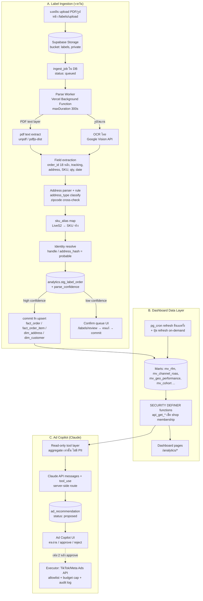

# 3J Jewelry — TikTok Ops App Architecture (Label Ingestion / Dashboard / Ad Copilot)

> **สถานะ: Design only — ยังไม่ implement** · ออกแบบโดย architect (Yoda) · ต่อยอด OMS เดิม (Next.js App Router + Supabase Postgres/RLS/Storage + Vercel, migrations 0001–0008)
> **อิง data model:** `docs/3j-jewelry/analytics/marketing-analytics-db-design.md` (schema `analytics`: dims/facts/marts, dim_address §11, sku_alias §12, TikTok label mapping §13, PDPA §7)
> **ความจริงข้อมูล:** TikTok mask ชื่อ+เบอร์ (ทั้งใบปะหน้าและ API) → identity TikTok = handle/address hash (probable) · LINE OA = identity exact · ข้อมูลเก็บจากวันนี้ไป · ~700 orders/เดือน

---

## 1. ภาพรวมสถาปัตยกรรม

3 ส่วนบนโครงเดิมทั้งหมด — ไม่เพิ่ม infra ใหม่นอกจาก Claude API และ OCR API:

หลักการรวม: **ทุกอย่างวิ่งบน Postgres/Vercel เดิม** — job queue คือ table + status (pattern เดียวกับ queue worker ที่ OMS มีอยู่แล้ว) ไม่เอา Redis/SQS/Inngest เข้ามาที่ scale ~30 ใบ/วัน

---

## 2. A — Label Ingestion Pipeline (ละเอียด)

### 2.1 Components + ไฟล์ที่จะสร้าง (ตอน implement)

| ส่วน | path | หน้าที่ |
|---|---|---|
| Upload UI | `app/(dashboard)/labels/upload/page.tsx` | drag-drop PDF/รูป หลายไฟล์ + แสดงสถานะ job |
| Upload action | `lib/actions/labels.ts` | server action: เขียนไฟล์เข้า Storage bucket `labels` (private) + insert `ingest_job` |
| Parse worker | `app/api/jobs/parse-labels/route.ts` | Vercel **Background Function** (`maxDuration: 300`) — หยิบ job queued → parse → staging |
| Cron trigger | `vercel.json` cron ทุก 10 นาที + trigger ทันทีหลัง upload | กัน job ค้าง |
| Parser lib | `lib/labels/pdf-extract.ts` `lib/labels/ocr.ts` `lib/labels/fields.ts` `lib/labels/address.ts` | pure functions → unit test ด้วย vitest ตรงๆ |
| Review UI | `app/(dashboard)/labels/review/page.tsx` | confirm queue: แก้แถว low-confidence แล้ว commit |
| Migration | `supabase/migrations/00xx_label_ingestion.sql` | `ingest_job`, `stg_label_order`, `sku_alias`, `dim_address`, commit function |

### 2.2 ตารางใหม่ (schema `analytics`)

- **`ingest_job`** — `id, shop_id, storage_path, file_hash (sha256), mime, status (queued/parsing/parsed/failed), page_count, error, attempts, created_by, timestamps` · unique `(shop_id, file_hash)` → **อัปไฟล์เดิมซ้ำ = no-op** (idempotency ชั้นไฟล์)
- **`stg_label_order`** — grain: 1 แถว = 1 ใบปะหน้า (1 order): `ingest_job_id, source_order_no (18 หลัก), tracking_no, raw_text, raw_address, parsed_address jsonb, address_type, items jsonb, order_date, parse_confidence (high/low/unparsed), status (pending/needs_review/committed/rejected), committed_fact_order_id` · unique `(shop_id, source_order_no)` → **order เดิมโผล่ในไฟล์อื่น = update staging ไม่ dup** (idempotency ชั้น order)
- **commit:** function `analytics.commit_label_order(stg_id)` — upsert `fact_order` ด้วย unique `(shop_id, source_order_no)` + upsert `dim_address` / `dim_customer_identity` / `fact_order_item` ใน transaction เดียว → **idempotent ชั้นสุดท้าย** รันซ้ำได้ผลเดิม

### 2.3 Parse ที่ไหน — ตัดสิน: **Vercel Background Function (Node runtime)**

| ทางเลือก | รับ/ตัดทิ้ง + เหตุผล |
|---|---|
| YES — Vercel Background Function | repo เดียว ภาษาเดียว (TS), maxDuration 300s พอสำหรับ batch ~30 ใบ, deploy พร้อมแอป, ไม่มี infra เพิ่ม |
| NO — Edge runtime | ไม่มี Node lib สำหรับ PDF, CPU/memory จำกัด |
| NO — Supabase Edge Function (Deno) | แยก runtime/แยก deploy, ecosystem PDF บน Deno อ่อนกว่า — ข้อดี "ใกล้ DB" ไม่ใช่คอขวด (คอขวดคือ OCR network call) |
| NO — Worker แยก (VM/Railway + queue) | over-engineer ที่ 30 ใบ/วัน — ย้ายทีหลังง่ายเพราะ queue เป็น table |

Trade-off ที่ยอมรับ: serverless ไม่มี long-running state → worker ออกแบบเป็น **resumable**: หยิบทีละไฟล์ mark status ต่อแถว timeout กลางทางรันรอบถัดไปต่อได้ (idempotent อยู่แล้ว)

### 2.4 PDF extract vs OCR ไทย

- **ทางหลัก:** ใบปะหน้า TikTok เป็น PDF generate จากระบบ → มี text layer → extract ด้วย `unpdf`/`pdfjs-dist` (แม่น, ฟรี, เร็ว) · detect: extract แล้วได้ text ยาวพอ + เจอ pattern order id → ข้าม OCR
- **Fallback รูป/สแกน:** ตัดสิน **Google Cloud Vision API**
  - รับ: ภาษาไทยแม่นสุดในกลุ่ม managed OCR, pay-per-use (~$1.5/1,000 หน้า — หลักสิบบาท/เดือนที่ 30 ใบ/วัน), เรียกจาก serverless ได้ตรง
  - ตัดทิ้ง Tesseract (tha): ฟรีแต่แม่นยำไทยต่ำ (สระ/วรรณยุกต์เพี้ยน) → address parse พังต่อเนื่อง = งาน manual review บาน แพงกว่าในทางปฏิบัติ
  - ตัดทิ้ง self-host VLM/Typhoon OCR: ต้อง GPU — เกินตัว
  - ข้อควรระวัง PDPA: ส่งภาพ (ที่อยู่จริง — ชื่อ/เบอร์ mask แล้วโดย TikTok) ออกไป processor ภายนอก → ระบุใน privacy notice (open question ข้อ 7)
- **Field extraction:** regex/anchor บน layout ค่อนข้างคงที่ — order id 18 หลัก, tracking JTTH..., ตาราง SKU/qty, วันที่ · เก็บ `raw_text` เสมอ → layout เปลี่ยนกู้ย้อนหลังได้

### 2.5 Address parse + classify + identity resolve

- Parser rule-based ไทย (`lib/labels/address.ts`): แยก house_no / moo / road / subdistrict / district / province / zipcode ด้วย keyword (ต. อ. จ. แขวง เขต ถ. ซ. หมู่) + **zipcode cross-check กับ `ref_thai_zipcode`** — ขัดกัน → parse_confidence = low (ตาม data model §11.2)
- `address_type` classify ด้วย keyword rule ตามตาราง §11.1 (condo / housing_project / company / ...) · `address_type_source = rule` คน override ได้ใน review UI
- `sku_alias`: map LiveS2 ฯลฯ → product_id · alias ใหม่ที่ไม่รู้จัก → เข้า review queue (**ไม่เงียบหาย ไม่เดา**)
- Identity resolve (TikTok ไม่มีเบอร์): key = sha256(normalized_address + zipcode) เป็น identity_type ใหม่ `address_hash` (confidence probable) + handle ถ้ามี — **ไม่ auto-merge** กับลูกค้า LINE แค่เสนอ match ให้คนยืนยันใน review UI

### 2.6 Error handling / retry / reconcile

- OCR/network fail → attempts++ + backoff (cron รอบถัดไปหยิบใหม่) · attempts >= 3 → failed แสดงหน้า upload ให้คนสั่ง retry
- Parse ได้บางหน้า → commit เป็นรายใบ (grain = order ไม่ใช่ไฟล์) หน้าเสีย flag รายแถว
- Reconcile รายวัน: count(staging committed) เทียบ count(fact_order จาก label) → alert ถ้า drift

---

## 3. B — Dashboard Data Layer

- **Marts เป็น materialized view → RLS ไม่ apply** (บทเรียน migration 0004) → **revoke ทุก mart จาก anon/authenticated** เข้าได้ทางเดียวผ่าน `SECURITY DEFINER` functions: `analytics.api_get_channel_roas(p_shop_id, p_from, p_to)`, `api_get_rfm_summary`, `api_get_geo_performance`, `api_get_cohort`, `api_get_product_performance`, `api_get_ingest_health` — ทุกตัวขึ้นต้นด้วยเช็ค `is_shop_member(p_shop_id)` + ล็อก `search_path` · grant execute เฉพาะ `authenticated`
- Next.js อ่านผ่าน server components → `supabase.rpc(...)` — **ไม่มี query ตรงถึง mart จาก client เด็ดขาด**
- **Refresh strategy:** `pg_cron` รัน `REFRESH MATERIALIZED VIEW CONCURRENTLY` คืนละครั้ง (ทุก mart ต้องมี unique index) + RPC `api_refresh_marts()` (definer, เช็ค role owner/admin) ผูกปุ่ม Refresh บน dashboard สำหรับหลัง commit label ตอนเช้า
  - Trade-off: ไม่ทำ real-time/trigger refresh — ตัดสินใจแอดเป็นรอบวัน, refresh ทั้งชุด < 1s ที่ scale นี้, incremental refresh ไม่คุ้มความซับซ้อน
- ความเร็ว: mart = pre-aggregate → dashboard select ตรงจาก mart ผ่าน RPC, p95 << 100ms — ไม่ต้องมี cache layer เพิ่ม (Next.js revalidate 60s พอ)

---

## 4. C — Ad Copilot: Claude Integration (หัวใจของ future vision)

### 4.1 หลักการความปลอดภัย (ใช้ทั้งสองเฟส)

1. Claude เห็นเฉพาะ **aggregate จาก marts** ผ่าน tool layer ที่เรียกชุด `api_get_*` เดิม — **ไม่มีทางเห็น PII ดิบ**: ไม่มี tool ไหน query `pii_customer` / `dim_address` รายแถว · audience ปรากฏเป็น "จำนวน + segment" ไม่ใช่รายชื่อ
2. Claude **ไม่ถือ credential ใดๆ** — tools ทั้งหมดเป็นโค้ดฝั่ง server เรา (service role อยู่ใน route เท่านั้น) Claude แค่ขอเรียก tool ตามชื่อ
3. ทุก recommendation ลงตาราง `ad_recommendation` พร้อม **rationale + evidence (mart snapshot jsonb)** — ตรวจย้อนได้ว่าแนะนำจากตัวเลขอะไร

### 4.2 Pattern — ตัดสิน: **Claude API (messages + tool_use) ฝังใน Next.js route** ไม่ใช่ MCP server แยก

| | Claude API + tool_use ในแอป (เลือก) | MCP server แยก (ตัดทิ้งตอนนี้) |
|---|---|---|
| Deploy | อยู่ใน Vercel เดิม | ต้อง host process เพิ่ม |
| Auth/RLS | reuse session + shop membership ของแอปตรงๆ | ต้องทำ auth bridge เอง |
| ใช้จาก Claude Desktop/Code | ไม่ได้ | ได้ |
| เหมาะเมื่อ | ผู้ใช้คือแอดมินในแอป (case เรา) | อยากให้หลาย client ต่อ analytics |

→ tool layer เขียนเป็น functions กลางใน `lib/copilot/tools.ts` — วันหน้าอยากถามจาก Claude Desktop ค่อยครอบชุดเดิมเป็น MCP server ได้โดยไม่เขียนใหม่

### 4.3 เฟส 1 — Advisory (human-in-the-loop เท่านั้น · ไม่แตะเงินเด็ดขาด)

- Route `app/api/copilot/analyze/route.ts` (เรียกจากหน้า `/copilot` หรือ cron รายสัปดาห์):
  1. system prompt = บริบทธุรกิจ 3J (flywheel: TikTok = reach / LINE = identity ทองคำ, งบ, เป้า ROAS)
  2. tools (read-only ทั้งหมด): `get_channel_roas`, `get_rfm_summary`, `get_geo_performance` (มี address_type dimension), `get_cohort_retention`, `get_product_performance`, `get_current_ad_spend`
  3. output บังคับผ่าน structured tool `submit_recommendations` → insert `ad_recommendation (shop_id, kind CHECK in (budget_shift, audience_create, geo_bid, creative_angle, campaign_pause), title, rationale, expected_impact, evidence jsonb, status = proposed, model, prompt_tokens, completion_tokens)`
- UI: การ์ดคำแนะนำ + ตัวเลขอ้างอิง → คน mark accepted/rejected (+เหตุผล) — เฟสนี้ accept = บันทึกว่าจะไปทำมือใน ads manager · **ระบบไม่ต่อ ad platform เลย**
- **Cost/token:** on-demand + สรุปรายสัปดาห์ (ไม่ยิงทุก pageview) · tools คืน aggregate ไม่กี่สิบแถว → ~10–30k tokens/รอบ = หลักสิบบาท/ครั้ง บน Sonnet-class (งานอ่านตาราง+สรุป ไม่ต้อง Opus) · เก็บ token usage ใน `ad_recommendation` ติดตาม cost จริง

### 4.4 เฟส 2 — Assisted execution (ทำเมื่อเฟส 1 พิสูจน์ค่า + spend สูงพอ)

ต่อ TikTok Ads API / Meta Marketing API ใน `lib/adplatform/` — **Claude ไม่เรียก ad API ตรง**: Claude เสนอ → คน approve → **executor ของเรา** เป็นคน call

Guardrails (hard requirement ทุกข้อ — enforce ใน code ไม่ใช่ใน prompt):
1. **คน approve ก่อนทุก action** — หน้า approve แสดง diff ชัด (งบเดิม → ใหม่, audience ไหน) + confirm 2 ชั้นสำหรับเรื่องเงิน
2. **Action allowlist**: `adjust_budget` (ภายใน cap), `pause_campaign`, `create_audience` (จาก `v_audience_export` hash + consent=true เท่านั้น), `adjust_geo_bid` — นอกลิสต์ = reject ที่ executor
3. **Budget cap**: ต่อ action (เช่น +-30% ของงบเดิม), ต่อวัน, ต่อเดือน — เก็บในตาราง `copilot_policy` แก้ได้เฉพาะ owner
4. **Audit log**: `ad_action_log (recommendation_id, actor_user_id, action, payload, previous_state jsonb, platform_response, executed_at)` — ทุก call ระบุคนรับผิดชอบได้
5. **Rollback**: snapshot `previous_state` ก่อน apply ทุกครั้ง + ปุ่ม revert (budget/bid/pause ย้อนได้ · audience ที่ upload แล้ว = สั่งลบ audience บน platform)
6. **PDPA**: audience ออกจาก `v_audience_export` เท่านั้น (SHA-256 + consent filter + `audience_export_log`) — ไม่มี path อื่น

**ห้าม auto เด็ดขาด (ทุกเฟส):**
- เพิ่มงบ / สร้าง campaign ใหม่ / แตะ billing โดยไม่มีคน approve
- upload audience อัตโนมัติ — ทุกครั้งต้องคนกด + log
- action นอก allowlist หรือเกิน cap แม้คนจะ approve (ต้องแก้ policy ก่อน)
- Claude ถือ ad platform token / DB credential เอง
- auto ได้อย่างเดียว: **อ่าน + เสนอ + แจ้งเตือน** (เช่น ROAS TikTok ต่ำกว่า threshold 3 วันติด)

---

## 5. Tech Choices สรุป + Trade-off ทุกจุดตัดสิน

| จุดตัดสิน | เลือก | ตัดทิ้ง + เหตุผล |
|---|---|---|
| Job queue | Postgres table + status + cron | Redis/Inngest/SQS — 30 job/วัน + pattern queue-in-DB มีใน OMS แล้ว |
| Parse runtime | Vercel Background Function (Node) | Edge (lib ไม่มี) · Supabase Fn (แยก runtime/deploy) · VM (over-engineer) |
| OCR ไทย | PDF text ก่อน → Google Vision fallback | Tesseract (แม่นยำไทยต่ำ → งาน manual บาน) · self-host VLM (GPU เกินตัว) |
| Address parse | rule-based + zipcode validation + human review | ML/LLM parse — 30 ใบ/วัน rule+คนไหว deterministic debug ง่าย · ถ้า low-confidence > 20% ค่อยเสริม LLM เป็น suggester |
| Mart access | SECURITY DEFINER `api_get_*` | grant view ตรง — mat. view ไม่มี RLS = ช่อง cross-shop (บทเรียน 0004) |
| Refresh | pg_cron nightly + manual RPC | trigger/real-time — ไม่คุ้มที่ cadence ตัดสินใจรายวัน |
| Claude pattern | messages + tool_use ใน Next.js | MCP server แยก — เพิ่ม deploy/auth surface โดยผู้ใช้อยู่ในแอปแล้ว · tool layer แชร์ไปทำ MCP ทีหลังได้ |
| Execution model | Claude เสนอ → คน approve → executor call API | ให้ Claude ถือ write tool ตรง — เสี่ยงเงินจริง และ guard ใน prompt ไม่ใช่ guard |
| Identity TikTok | address_hash + handle = probable, no auto-merge | fuzzy merge — false-merge ทำ RFM/audience เพี้ยน แพงกว่า miss-merge |

---

## 6. Rollout Phases + ความเสี่ยง

| Phase | ของที่ส่ง | Gate ก่อนไปต่อ |
|---|---|---|
| **P1** (สัปดาห์ 1–2) | migration (ingest_job / stg / dim_address / sku_alias / commit fn) + upload UI + PDF text extract + address rule + review UI | parse accuracy >= 90% บนใบจริง ~50 ใบ |
| **P2** (สัปดาห์ 2–3) | `api_get_*` + dashboard pages + pg_cron refresh + live-weight COGS estimate (ข้อ 3) | ตัวเลข mart ตรงกับนับมือ 1 สัปดาห์ · (OCR ตัดออก — PDF text ล้วน) |
| **P3** (สัปดาห์ 3–4) | Ad Copilot เฟส 1 (advisory) + `ad_recommendation` + หน้า `/copilot` | เจ้าของประเมินคำแนะนำ "ใช้ได้จริง" >= ครึ่ง ภายใน 2–4 สัปดาห์ |
| **P4** (เมื่อคุ้ม) | เฟส 2 executor + allowlist/cap/audit/rollback + audience upload flow | spend/เดือนสูงพอ + `copilot_policy` อนุมัติโดย owner |

ความเสี่ยง:
1. **TikTok เปลี่ยน layout ใบปะหน้า** → field extraction พัง — เก็บ raw_text เสมอ + reconcile alert รายวัน + parser เป็น pure function มี fixture test
2. **OCR ไทยเพี้ยนบนสแกนคุณภาพต่ำ** → confidence gate เข้ม ทุกอย่างที่ไม่ชัวร์เข้า review (ช้าแต่ไม่ผิด)
3. **Mat. view grant ผิด = ข้อมูลข้าม shop** — ต้องมี test ใน `supabase/tests` ยิงด้วย role authenticated พิสูจน์ว่า select mart ตรงโดน reject
4. **Claude แนะนำจากข้อมูลบาง** (เดือนแรกข้อมูลน้อย) — บังคับ evidence + แสดง sample size บนการ์ด · ต่ำกว่า threshold ให้ตอบ "ข้อมูลยังไม่พอ" แทนการมั่ว
5. **Vercel 300s ไม่พอ** ถ้า batch ใหญ่ผิดปกติ — worker resumable ต่อรอบถัดไปได้ · เรื้อรังค่อยย้าย consumer ออก (queue เป็น table ย้ายง่าย)
6. **PDPA — ภาพใบปะหน้าออกไป Vision API** — ชื่อ/เบอร์ mask แล้วโดย TikTok เหลือที่อยู่ · ระบุ processor ใน privacy notice · ถ้าเจ้าของไม่โอเค ใช้ Tesseract + review หนักขึ้น

---

## 7. Decisions (ยืนยันจากเจ้าของแล้ว) + ผลต่อ architecture

1. **ใบปะหน้า = PDF จาก Seller Center (มี text layer) ทั้งหมด** → **ตัด OCR ออกจาก P1** ใช้ `unpdf`/`pdfjs` text extract อย่างเดียว (แม่น ฟรี ไม่มี dependency นอก) · ถ่ายรูป/สแกน = กรอกมือ (ปริมาณน้อย เจ้าของอัปเอง)
2. **เจ้าของ upload/review เอง** (single user เฟสแรก) → ออกแบบ role/permission ไว้ใน schema แต่ **ยังไม่ build access control** · เปิดให้แอดมินคนอื่นทีหลัง (RLS shop membership รองรับอยู่แล้ว)
3. **Seller SKU generic = `LiveS05…LiveS75` (เงินขายตามกรัม 0.5–7.5g @ ~150฿/g) + `live05/live1` (รุ่นเก่า @120฿/g)** — seed `sku_alias` จากลิสต์นี้ → **ผูกกับ pseudo-product "Live silver by weight"** (ไม่ใช่แบบเฉพาะ)
   - → ⚠️ **TikTok live ขายตามน้ำหนัก ไม่ผูกแบบสินค้า** = product/design-level analytics ทำกับ live order ไม่ได้ (ได้แค่ weight tier + revenue)
   - → ✅ **แต่ประมาณกำไรได้จากน้ำหนัก**: grams (จาก LiveSxx) × ต้นทุนเงิน/กรัม → `cogs` estimate → `profit_status='estimated'` = **แก้ส่วนหนึ่งของกำไรหาย 58%** โดยไม่ต้องกรอกมือ (เก็บ `silver_cost_per_gram` ใน `copilot_policy`/setting refresh เป็นรอบ)
4. **Ad Copilot cadence → แนะนำ: on-demand "pre-flight ก่อนยิงแอดทุกครั้ง"** (ไม่ทำ scheduled weekly) — ตรงเป้าเจ้าของ (เจาะกลุ่มชัด + ลงทุนไม่เยอะ): กด Analyze ก่อนวางแคมเปญ → Claude สรุปว่า "รอบนี้ควรยิงใคร/ที่ไหน/งบเท่าไร" จากข้อมูลล่าสุด · ประหยัดสุด (จ่ายเฉพาะตอนใช้)
5. **งบ = on-demand, ≤1,000฿/สัปดาห์** → ใช้ Sonnet-class, tools คืน aggregate → ~10–30k tokens/รอบ = หลักสิบบาท/ครั้ง → ยิงได้ ~หลายสิบครั้ง/สัปดาห์ในงบ (เหลือเฟือสำหรับ pre-flight) · เก็บ token usage ต่อ recommendation ติดตามจริง
6. **เฟส 2 = TikTok Ads + Meta ทั้งคู่** → tool layer `lib/adplatform/{tiktok,meta}.ts` แยก adapter · **แนะนำเริ่ม Meta ก่อน** (custom audience + lookalike จาก LINE-seed แม่นกว่า เป็นจุดแข็ง flywheel) แล้วตาม TikTok · ขอ API access ทั้ง 2 ล่วงหน้า
7. **OCR → แนะนำ: ไม่ใช้ Google Vision เลย** (ข้อ 1 = PDF text ครบ 100%) → **ไม่มีข้อมูลออกนอกประเทศ = PDPA สะอาด + ต้นทุน OCR = 0** · เคสรูป/สแกนที่นานๆเจอ → กรอกมือ (เจ้าของอัปเอง volume ต่ำ คุ้มกว่าตั้ง OCR ทั้งระบบ) · เปิด OCR ทีหลังเฉพาะถ้ารูป-label เยอะขึ้นจริง
