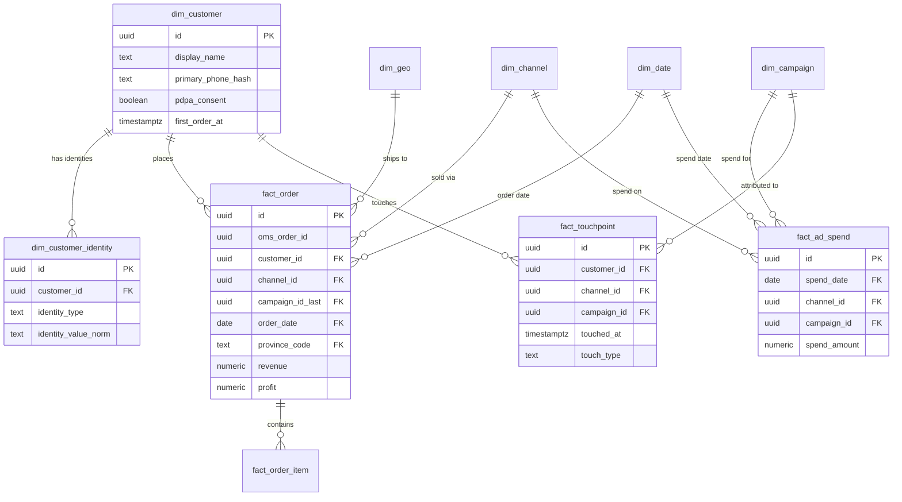

# 3J Jewelry — Marketing Analytics Data Model (Design)

> **สถานะ:** Design only — ยังไม่ apply migration · ออกแบบโดย architect (Yoda) · อิงข้อมูลจริง ก.ค. 2026 (~700 orders/เดือน)
> **เป้าหมายหลัก:** ยิงแอดข้าม platform (TikTok/Meta/Google) ให้แม่น + วัด ROAS/CAC + ตัดสินใจการตลาดด้วยตัวเลข

---

## 1. ภาพรวมสถาปัตยกรรม

**หลักการ:** ใช้ Supabase Postgres เดิม แต่แยก **schema `analytics`** ออกจาก schema `public` (OMS) — ไม่ตั้ง warehouse ใหม่

```
+- Operational layer (public schema — OMS เดิม, ห้ามแตะ hot path) -+
| orders / order_item / channel / channel_account / product        |
+--------------+---------------------------------------------------+
               | ELT: pg_cron ทุกคืน (หรือ on-demand) — plain SQL upsert
               v
+- Analytics layer (schema: analytics) ----------------------------+
| Staging:   stg_order_import (รับ export Shopee/มือ)              |
| Dims:      dim_customer, dim_customer_identity, dim_channel,     |
|            dim_campaign, dim_date, dim_geo (dim_product = public)|
| Facts:     fact_order, fact_order_item, fact_ad_spend,           |
|            fact_touchpoint                                       |
| Marts:     mv_rfm_segment, mv_customer_ltv, mv_channel_roas,     |
|            mv_cohort_retention, mv_geo_performance,              |
|            v_audience_export (hashed)                            |
+------------------------------------------------------------------+
```

**ทำไมไม่ใช้ BigQuery/dbt/Kafka:** 700 orders/เดือน = ~8,400 แถว/ปี — Postgres เครื่องเดียวสบายไปอีก 10 ปี materialized view refresh ทั้งชุดใช้เวลา < 1 วินาที ที่สเกลนี้เครื่องมือ big data คือ overhead ล้วนๆ (trade-off: ถ้าโตเป็น 100k orders/เดือน ค่อยยก marts ไป warehouse — schema แยกไว้แล้วทำให้ยกง่าย)

**ทำไม ELT copy เข้า fact แทนอ่านตรงจาก OMS view:**
- Analytics query หนักๆ ไม่กวน RLS/lock ของ OMS
- Fact เก็บค่า **snapshot ณ เวลาขาย** (กำไร, cost) — OMS แก้ราคา product ย้อนหลังไม่ทำให้ history เพี้ยน
- Trade-off: ข้อมูล lag ได้ถึง 1 วัน — ยอมรับได้เพราะตัดสินใจแอดเป็นรอบวัน/สัปดาห์ ไม่ใช่ real-time

### ERD (mermaid)



---

## 2. Dimension Tables (schema `analytics`)

### 2.1 `dim_customer` — หัวใจของ identity resolution

| column | type | note |
|---|---|---|
| `id` | uuid PK | `gen_random_uuid()` |
| `shop_id` | uuid FK -> public.shop | multi-tenant + RLS เหมือน OMS |
| `display_name` | text | ชื่อล่าสุดที่เห็น (PII จริงอยู่ตาราง `pii_customer` แยก) |
| `primary_phone_hash` | text | SHA-256(เบอร์ normalize E.164) — ใช้ join/export ไม่เก็บเบอร์ดิบที่นี่ |
| `email_hash` | text null | SHA-256(lower(email)) เผื่ออนาคต |
| `pdpa_consent` | boolean not null default false | ยินยอมใช้ข้อมูลทำการตลาด/audience |
| `consent_at` / `consent_source` | timestamptz / text | หลักฐาน consent |
| `first_order_at` / `last_order_at` | timestamptz | denorm ไว้ให้ RFM เร็ว (update ตอน ELT) |
| `first_touch_channel_id` | uuid FK -> dim_channel | acquisition channel — ใช้ทำ cohort |
| `merged_into_id` | uuid FK -> dim_customer null | soft-merge: ถ้า resolve ทีหลังว่าเป็นคนเดียวกัน ชี้ไป master record ไม่ลบทิ้ง (audit ได้) |
| `created_at` / `updated_at` | timestamptz | |

### 2.2 `dim_customer_identity` — ตัวเชื่อมข้าม platform

Grain: 1 แถว = 1 identity ของลูกค้า (เบอร์ / LINE user id / TikTok handle / FB name)

| column | type | note |
|---|---|---|
| `id` | uuid PK | |
| `shop_id` | uuid FK | |
| `customer_id` | uuid FK -> dim_customer | |
| `identity_type` | text CHECK in ('phone','line_id','tiktok_handle','facebook','shopee_username','email') | |
| `identity_value_norm` | text | **normalize แล้ว**: phone -> E.164, handle -> lower/trim |
| `identity_value_hash` | text | SHA-256 ของค่า norm — ใช้ export |
| `confidence` | text CHECK in ('exact','probable','manual') | phone match = exact; ชื่อคล้าย = probable ต้อง manual confirm |
| unique | (shop_id, identity_type, identity_value_norm) | identity หนึ่งค่าเป็นของคนเดียว |

**Resolution rule (deterministic-first):** จับด้วย**เบอร์โทร normalize** เป็นหลัก (มีในทุก order ที่จัดส่ง) -> ถ้าไม่มีเบอร์ ใช้ (channel + handle) -> ชื่อเฉยๆ **ไม่ auto-merge** แค่ flag `probable` ให้คน confirm ใน admin UI
*Trade-off:* ปฏิเสธ probabilistic matching (fuzzy name+province) เพราะ 700 orders/เดือนคนตรวจมือไหว และ false-merge ทำ RFM/audience เพี้ยนแพงกว่า miss-merge

### 2.3 `dim_channel`

แก้ปัญหา `line_oa` vs `LINE_OA` ที่ต้นเหตุ: ตารางนี้เป็น **canonical list** + ตาราง alias

| column | type | note |
|---|---|---|
| `id` | uuid PK | |
| `code` | text unique | canonical: `tiktok`, `line_oa`, `shopee`, `facebook` — lowercase enforced ด้วย CHECK (code = lower(code)) |
| `name` | text | ชื่อแสดงผล |
| `channel_role` | text CHECK in ('acquisition','conversion','both') | จับ insight "TikTok หาคน -> LINE ปิด" เป็น metadata ใช้ในรายงาน |
| `oms_channel_id` | uuid FK -> public.channel null | ผูกกับ channel ของ OMS ถ้ามี |

พร้อม `dim_channel_alias (alias_raw text unique, channel_id uuid)` — ELT map ค่า raw ทุกแบบ (LINE_OA, Line, line) เข้า canonical อัตโนมัติ; เจอ alias ใหม่ที่ map ไม่ได้ -> ลง `stg_unmapped_channel` ให้คนเคลียร์ ไม่เงียบหาย

### 2.4 `dim_campaign`

| column | type | note |
|---|---|---|
| `id` | uuid PK | |
| `shop_id` | uuid FK | |
| `channel_id` | uuid FK -> dim_channel | platform ที่ยิง |
| `platform_campaign_id` | text null | id จาก ads manager (เผื่อ API เฟสหลัง) |
| `name` | text | |
| `utm_source` / `utm_medium` / `utm_campaign` / `utm_content` | text | ใช้ match touchpoint จากลิงก์ |
| `objective` | text CHECK in ('awareness','traffic','conversion','live','retargeting') | |
| `started_at` / `ended_at` | date | |
| unique | (shop_id, channel_id, coalesce(platform_campaign_id, name)) | กันซ้ำ |

### 2.5 `dim_date`

ตาราง calendar generate ล่วงหน้า 2019–2035: `date_key date PK, year, quarter, month, month_name_th, day_of_week, is_weekend, is_payday_window boolean (วันที่ 25–5 — ช่วงเงินเดือนออก ยอดเครื่องประดับขึ้น)`
*Trade-off:* จะใช้ `date_trunc` เอาก็ได้ แต่ dim_date ทำให้ query mart อ่านง่ายและเพิ่ม flag ธุรกิจ (payday, เทศกาล) ได้โดยไม่แก้ SQL ทุก view

### 2.6 `dim_geo`

| column | type |
|---|---|
| `province_code` | text PK (มาตรฐาน ISO เช่น `TH-10`) |
| `province_name_th` / `province_name_en` | text |
| `region` | text CHECK in ('bkk_metro','central','north','northeast','east','west','south') |
| `is_unknown` | boolean — แถวพิเศษ `TH-XX` สำหรับ order ที่ไม่รู้จังหวัด (ดีกว่า NULL: aggregate ไม่หลุด) |

### 2.7 `dim_product` — **ไม่สร้างใหม่** ใช้ `public.product` (มี sku, name, unit_cost แล้ว) + view `analytics.v_dim_product` ที่เพิ่ม `category` (แหวน/สร้อย/กำไล — เก็บเพิ่มเฟสหลังถ้าต้องการ)
*Trade-off:* ผูกตรงกับ operational table = ถ้า OMS ลบ product จะกระทบ — ป้องกันด้วย FK `on delete restrict` ฝั่ง fact และ snapshot ชื่อ/cost ใน fact_order_item อยู่แล้ว

---

## 3. Fact Tables

### 3.1 `fact_order` — grain: **1 แถว = 1 order**

| column | type | note |
|---|---|---|
| `id` | uuid PK | |
| `shop_id` | uuid FK | |
| `oms_order_id` | uuid unique null | FK -> public.orders ถ้ามาจาก OMS; null ถ้ามาจาก import มือ (เช่น export ก.ค.) |
| `source_order_no` | text | เลข order จาก export |
| `customer_id` | uuid FK -> dim_customer | จาก identity resolution |
| `channel_id` | uuid FK -> dim_channel not null | ช่องทางที่ **ปิดการขาย** |
| `campaign_id_first` / `campaign_id_last` | uuid FK -> dim_campaign null | denorm attribution จาก fact_touchpoint (ดู §6) |
| `order_date` | date FK -> dim_date not null | |
| `paid_at` / `printed_at` | timestamptz | จาก export (วันโอน/พิมพ์) |
| `ship_date` / `estimated_delivery_date` | date null | จากใบปะหน้า TikTok (ShippingDate / EstimatedDate) |
| `province_code` | text FK -> dim_geo default 'TH-XX' | |
| `carrier_code` | text | |
| `item_count` | int | |
| `revenue` | numeric(12,2) not null | ยอดขาย |
| `discount` | numeric(12,2) default 0 | |
| `shipping_fee_customer` / `shipping_cost_shop` | numeric(12,2) | ค่าส่งเก็บลูกค้า / ร้านจ่าย |
| `cogs` | numeric(12,2) null | ต้นทุนสินค้า — snapshot ตอน ELT จาก order_item หรือกรอก |
| `profit` | numeric(12,2) null | |
| `profit_status` | text CHECK in ('complete','estimated','missing') not null default 'missing' | **แก้ปัญหากำไรกรอกไม่ครบ 58%** — mart กรองหรือ estimate ได้ชัดเจน ไม่ปนกัน |
| `payment_method` / `bank` | text | |
| `is_new_customer` | boolean | denorm: order แรกของ customer นี้ไหม (คำนวณตอน ELT) |
| `tags` | text[] | จาก export |

Index: `(shop_id, order_date)`, `(customer_id)`, `(channel_id, order_date)`

### 3.2 `fact_order_item` — grain: 1 แถว = 1 SKU ใน 1 order (มีเมื่อ order มาจาก OMS หรือ export มี line item)

`id, shop_id, fact_order_id FK, product_id FK -> public.product null, sku_snapshot text, product_name_snapshot text, qty, unit_price, unit_cost_snapshot numeric null`
*Note:* export ก.ค. อาจไม่มี line item -> fact_order ยังทำงานได้ครบทุก mart ยกเว้น product performance (open question §10)

### 3.3 `fact_ad_spend` — grain: **1 แถว = 1 วัน x 1 campaign** (หรือ 1 วัน x 1 channel ถ้ายังไม่แยก campaign)

| column | type | note |
|---|---|---|
| `id` uuid PK · `shop_id` uuid FK | | |
| `spend_date` | date FK -> dim_date not null | |
| `channel_id` | uuid FK not null | |
| `campaign_id` | uuid FK null | null = spend ระดับ platform รวม (เริ่มกรอกมือหยาบก่อนได้) |
| `spend_amount` | numeric(12,2) not null check >= 0 | |
| `impressions` / `clicks` / `platform_reported_conversions` | bigint null | กรอกจาก ads manager ถ้ามี |
| `entry_method` | text CHECK in ('manual','api') default 'manual' | เฟสหลังต่อ API ทับได้ไม่ชนกัน |
| unique | (shop_id, spend_date, channel_id, coalesce(campaign_id, uuid_nil())) | upsert รายวันได้ |

### 3.4 `fact_touchpoint` — grain: 1 แถว = 1 เหตุการณ์ที่ลูกค้าสัมผัสช่องทาง/แคมเปญ

| column | type | note |
|---|---|---|
| `id` uuid PK · `shop_id` uuid FK · `customer_id` uuid FK null (ผูกทีหลังได้เมื่อ resolve) | | |
| `channel_id` | uuid FK not null | |
| `campaign_id` | uuid FK null | match จาก UTM หรือแอดมินเลือกตอนสร้าง order |
| `touched_at` | timestamptz not null | |
| `touch_type` | text CHECK in ('ad_click','live_view','line_add_friend','chat','order') | |
| `utm_raw` | jsonb null | เก็บ UTM ดิบทั้งก้อนไว้ debug |
| `source_ref` | text | เช่น order id ที่ทำให้เกิด touchpoint นี้ |

*ความจริงที่ต้องยอมรับ:* Phase แรก touchpoint มาจาก 2 ทางเท่านั้น — (1) แอดมินถามลูกค้าใน LINE "เห็นเราจากไหน" แล้วเลือกตอนสร้าง order (2) UTM บนลิงก์ที่คุมได้ (LINE broadcast, bio link) — TikTok organic/live วัด click-level ไม่ได้ นี่คือข้อจำกัดของ platform ไม่ใช่ของ schema

---

## 4. Analytical Views / Marts (materialized views, refresh คืนละครั้งด้วย pg_cron)

> ทุก mart อ่าน `dim_customer` เฉพาะแถวที่ `merged_into_id is null` (master records)

### 4.1 `mv_rfm_segment` — 1 แถว/customer

```sql
create materialized view analytics.mv_rfm_segment as
with base as (
  select customer_id,
         max(order_date) as last_order,
         count(*) as frequency,
         sum(revenue) as monetary
  from analytics.fact_order group by customer_id
), scored as (
  select *,
    ntile(5) over (order by last_order)  as r_score,   -- 5 = ซื้อล่าสุด
    ntile(5) over (order by frequency)   as f_score,
    ntile(5) over (order by monetary)    as m_score
  from base
)
select *,
  case
    when r_score >= 4 and f_score >= 4 then 'champion'
    when r_score >= 4 and f_score <= 2 then 'new_promising'
    when r_score <= 2 and f_score >= 3 then 'at_risk'      -- เคยซื้อบ่อยแต่หาย -> win-back
    when r_score <= 2 and f_score <= 2 then 'hibernating'
    else 'regular'
  end as segment
from scored;
```

### 4.2 `mv_customer_ltv` — revenue/profit สะสม, AOV, acquisition channel, เดือนแรกที่ซื้อ (join dim_customer.first_touch_channel_id) — ใช้จัดอันดับ seed lookalike

### 4.3 `mv_channel_roas` — 1 แถว/channel/เดือน

```sql
-- sketch: aggregate spend และ order แยก CTE ก่อน join กัน จะไม่ double-count
with spend as (
  select date_trunc('month', spend_date) as m, channel_id, sum(spend_amount) as spend
  from analytics.fact_ad_spend group by 1, 2
), rev as (
  select date_trunc('month', order_date) as m, channel_id,
         sum(revenue) as revenue,
         sum(revenue) filter (where is_new_customer) as new_customer_revenue,
         count(*) filter (where is_new_customer)     as new_customers,
         avg((profit_status = 'complete')::int)      as profit_coverage_pct
  from analytics.fact_order group by 1, 2
)
select r.m, c.code as channel, s.spend, r.revenue, r.new_customers,
       r.revenue / nullif(s.spend, 0)        as roas,
       s.spend / nullif(r.new_customers, 0)  as cac,
       r.profit_coverage_pct
from rev r
left join spend s using (m, channel_id)
join analytics.dim_channel c on c.id = r.channel_id;
```
`profit_coverage_pct` กำกับทุกแถว — บอกว่าตัวเลขกำไรเชื่อได้แค่ไหน

### 4.4 `mv_cohort_retention` — cohort = (เดือนที่ซื้อครั้งแรก x first_touch_channel) -> % กลับมาซื้อใน M+1, M+2, M+3 — ตอบตรงๆ ว่า "ลูกค้าที่มาจาก TikTok กลับมาซื้อผ่าน LINE กี่ %" (join channel ของ order ถัดไป)

### 4.5 `mv_geo_performance` — revenue/profit/AOV/จำนวน order ต่อ province+region ต่อเดือน + `unknown_pct` กำกับ

### 4.6 `v_audience_export` — **view ธรรมดา (ไม่ mat.) + security_barrier** — คอลัมน์มีแค่ `phone_sha256, email_sha256, segment, ltv_tier` และ **WHERE pdpa_consent = true** เท่านั้น — ไม่มี PII ดิบหลุดออกทาง view นี้ได้เลย

---

## 5. แต่ละส่วนช่วยยิงแอดยังไง (จุดที่ทั้ง design นี้มีไว้เพื่อ)

| ใช้อะไร | ทำอะไรได้ | Action จริง |
|---|---|---|
| `v_audience_export` + `mv_rfm_segment` = champion/high-LTV | **Seed lookalike** บน TikTok/Meta (upload hashed phone list) | ลูกค้า LINE AOV ฿1,528 คือ seed ทองคำ — lookalike จากกลุ่มนี้แม่นกว่า broad targeting มาก |
| segment `at_risk` / `hibernating` | **Retargeting / win-back** custom audience + LINE broadcast | งบน้อยแต่ conversion สูงสุด (คนเคยซื้อแล้ว) |
| `mv_channel_roas` (CAC, ROAS, new_customer_revenue ต่อ channel) | **จัดสรร budget ข้าม platform** รายเดือน | เห็นชัดว่า 1 บาทบน TikTok ได้ลูกค้าใหม่กี่คน เทียบ Meta |
| `mv_cohort_retention` | รู้ว่า TikTok acquisition คุ้มจริงไหมเมื่อรวม repeat ผ่าน LINE | ตัดสิน "AOV ฿490 ต่ำ แต่ LTV รวมสูง" ด้วยตัวเลข ไม่ใช่ความรู้สึก |
| `mv_geo_performance` | **Geo targeting** ในแอด — จังหวัด AOV สูง bid แรงขึ้น | ลด waste จาก broad ทั้งประเทศ |
| `dim_campaign` + `fact_touchpoint` | รู้ว่าแคมเปญ/ครีเอทีฟไหน**ก่อ**ลูกค้า ไม่ใช่แค่ view | ปิดแคมเปญที่ spend สูงแต่ touchpoint->order ต่ำ |
| `fact_order_item` + product | สินค้าไหนดึงลูกค้าใหม่ vs สินค้า repeat | เลือก hero product ขึ้นแอด/live |

---

## 6. Attribution Model

**เลือก: เก็บ raw touchpoint แล้ว denorm ทั้ง first-touch และ last-touch ลง fact_order** (`campaign_id_first`, `campaign_id_last`)

- **First-touch** ตอบ "ช่องทางไหน**หาลูกค้าใหม่**เก่ง" -> ใช้จัด budget acquisition (TikTok)
- **Last-touch** ตอบ "ช่องทางไหน**ปิดการขาย**" -> ใช้วัด conversion ops (LINE OA)
- ธุรกิจนี้ journey สั้นและรู้ pattern แล้ว (TikTok -> LINE) — 2 มุมนี้ครอบคลุมการตัดสินใจจริงทั้งหมด

*Trade-off ที่ตัดทิ้ง:*
- **Multi-touch / linear / time-decay** — ต้องมี touchpoint ครบทุก click ซึ่ง TikTok organic/live ให้ไม่ได้ ที่สเกลนี้จะได้ model สวยบนข้อมูลโหว่ = หลอกตัวเอง (แต่ fact_touchpoint เก็บ raw ไว้แล้ว อนาคตเปลี่ยน model ได้โดยไม่แก้ schema — แค่เพิ่ม view)
- **Platform-reported attribution (TikTok Ads Manager)** — นับ conversion เกินจริงและข้าม platform เทียบกันไม่ได้ ใช้เป็นตัวเลขอ้างอิงใน fact_ad_spend เท่านั้น ไม่ใช่ source of truth

**Ingestion plan:**
1. **ตอนสร้าง order ใน OMS (แก้ฟอร์ม)** — เพิ่ม field: `acquisition_source` (dropdown จาก dim_channel — ถามลูกค้า "รู้จักเราจากไหน"), `campaign_ref` (optional), จังหวัด (บังคับตอนกรอกที่อยู่), ต้นทุน/กำไร (บังคับก่อนพิมพ์ใบปะหน้า)
2. **fact_ad_spend กรอกมือ** — หน้า admin ง่ายๆ กรอกรายวัน/รายสัปดาห์จาก ads manager (5 นาที/วัน) — `entry_method='manual'`
3. **เฟสหลัง** — TikTok Marketing API / Meta Marketing API ดึง spend+campaign อัตโนมัติ upsert ทับด้วย `entry_method='api'` (unique key รองรับแล้ว) — ทำเมื่อ spend/เดือนสูงพอให้คุ้มค่า dev

---

## 7. Data Governance / PDPA

- **PII แยกตาราง:** `analytics.pii_customer (customer_id PK, phone_e164, full_name, address jsonb)` — RLS เข้มสุด เฉพาะ role owner/admin · dim/fact/mart เก็บเฉพาะ **hash**
- **Hashing:** SHA-256 ตาม spec ของ TikTok/Meta/Google custom audience — normalize ก่อน hash (phone -> E.164 `+66...` ตัด space/dash, email -> lowercase) มิฉะนั้น match rate ต่ำ · ทำใน Postgres ด้วย `encode(digest(..., 'sha256'), 'hex')` (pgcrypto มีใน Supabase แล้ว)
- **Consent:** `pdpa_consent` default **false** — เปิดเมื่อมีหลักฐาน (ลูกค้า add LINE + แจ้ง privacy notice, หรือ checkbox) · `v_audience_export` filter consent=true เสมอ + log ทุกครั้งที่ export (`audience_export_log`: ใคร, เมื่อไร, กี่แถว, ไป platform ไหน) — PDPA ต้องแสดง record of processing ได้
- **RLS:** ทุกตารางใน schema analytics มี `shop_id` + policy เดียวกับ OMS (member ของ shop เท่านั้น) · marts เป็น materialized view ซึ่ง **RLS ไม่ apply** -> **ห้าม grant mart ให้ anon/authenticated ตรงๆ** ให้เข้าผ่าน `security definer` function หรือ view ครอบที่เช็ค shop membership (บทเรียน revoke/grant Supabase จาก migration 0004)
- **Retention:** PII ลูกค้าที่ไม่ซื้อ > 3 ปี -> anonymize (ลบ pii_customer, เหลือ hash + aggregate)

---

## 8. Rollout Phases + Data-Quality Fixes

**Phase 1 — Foundation (สัปดาห์ 1–2):** สร้าง schema analytics + dims + fact_order + **fact_order_item** (ยืนยันว่ามี SKU) + stg_order_import · เขียน ELT import export ก.ค. (normalize channel ผ่าน alias, resolve customer ด้วยเบอร์, geo -> TH-XX ถ้า unknown) · ได้ mv_rfm + mv_geo + **product performance** ทันที

**Phase 2 — หยุดเลือดที่ต้นทาง (สัปดาห์ 2–3, แก้ที่ OMS):**
- บังคับกรอก **cogs/profit ก่อน order เปลี่ยนสถานะเป็น to_ship** (แก้ 58% missing) — ถ้าบังคับแข็งไปทำงานสะดุด ใช้ soft-block + dashboard "orders ไม่มีต้นทุน" ให้เคลียร์รายวัน
- **จังหวัดบังคับ** ตอนกรอกที่อยู่จัดส่ง (dropdown ไม่ใช่ free text) — TikTok order ที่แพ็กส่งเองยังไงก็มีที่อยู่ แก้ 65% unknown ได้เกือบหมด
- **channel เป็น FK ไป dim_channel** ในฟอร์ม ไม่ใช่ text — ฆ่าปัญหา case ซ้ำถาวร
- เพิ่ม `acquisition_source` + `campaign_ref` ในฟอร์มสร้าง order

**Phase 3 — Ad measurement (สัปดาห์ 3–4):** fact_ad_spend + หน้ากรอกมือ + mv_channel_roas + dim_campaign + UTM convention สำหรับลิงก์ทั้งหมด

**Phase 4 — Activation (เดือน 2):** v_audience_export + export flow (CSV hashed -> upload TikTok/Meta) + consent capture + mv_cohort_retention

**Phase 5 (ทำเมื่อคุ้ม):** Marketing API integration, product-level analytics, dashboard

---

## 9. ความเสี่ยง

1. **Identity resolution พังเงียบ** ถ้าเบอร์กรอกหลาย format — ต้อง normalize E.164 ที่ ELT เสมอ + unique constraint บน identity จับ conflict
2. **Materialized view + RLS** — จุดหลุด PII/ข้อมูลข้าม shop คลาสสิกบน Supabase ถ้า grant ผิด (ดู §7)
3. **การบังคับกรอกที่ OMS** กระทบ speed หน้างานช่วง live — ต้อง test กับแอดมินจริงก่อน hard-enforce
4. **Hash match rate ต่ำ** ถ้า normalize ไม่ตรง spec platform — เขียน unit test ค่า hash เทียบตัวอย่างจาก docs ของ TikTok/Meta
5. **fact กับ OMS drift** — ELT ต้อง idempotent (upsert ด้วย oms_order_id) + นับ row เทียบทุกคืน

---

## 10. Decisions (ยืนยันจากเจ้าของแล้ว) + ผลต่อ design

1. **Platform ที่จะยิง** — *ยังไม่ตัดสิน* → คง design แบบ **platform-generic** ไว้ (dim_channel/hash/export รองรับทุก platform อยู่แล้ว) เลือกทีหลังได้ไม่ต้องแก้ schema ✅
2. **Line item ระดับ SKU** — *มี* → **`fact_order_item` เลื่อนขึ้นมาทำใน Phase 1** · เปิด product performance mart (สินค้าไหนดึงลูกค้าใหม่ vs repeat) ได้ตั้งแต่ต้น
3. **ต้นทุน/กำไรหาย 58%** — *TikTok ไม่ให้ข้อมูล* (marketplace ปิดต้นทุน/ข้อมูลลูกค้า) เจ้าของจะเริ่มแนบใบปะหน้า/เก็บต้นทุน **จากออเดอร์ใหม่เป็นต้นไป**
   - → order เก่า TikTok คง `profit_status='missing'` (ไม่ย้อนแก้) · ออเดอร์ใหม่ตั้งเป้า `'complete'`
   - → **สำคัญ:** TikTok Shop ปิดทั้งต้นทุน **และเบอร์/ที่อยู่ลูกค้า** ด้วย = order TikTok ส่วนใหญ่ identity ได้แค่ handle (`probable`) ไม่มีเบอร์ → **audience/lookalike สร้างจากฝั่ง LINE เป็นหลัก** (ดูข้อ 6) ไม่ใช่จาก TikTok
4. **Consent ปัจจุบัน** — *ยังไม่ยืนยัน* → default `false` ตามเดิม เก็บ consent จากลูกค้าใหม่ผ่าน LINE (Phase 4)
5. **ใครกรอก ad spend** — *ยังไม่ระบุ* → หน้ากรอกรองรับทั้ง owner/admin ผ่าน RLS shop membership
6. **LINE user id** — *ได้ / มี LINE OA Messaging API* → **identity ฝั่ง LINE เป็น `exact`** (`identity_type='line_id'`, confidence `exact`)
   - → ลูกค้า LINE (segment มูลค่าสูงสุด AOV ฿1,528) จับตัวตนแม่น = **seed lookalike คุณภาพสูงสุด** · เก็บ userId ตอนแชท/add friend เข้า `dim_customer_identity`

> **กลยุทธ์ที่ตกผลึกจากคำตอบ:** TikTok = reach/acquisition (แต่ข้อมูลลูกค้าปิด) · **LINE = แหล่งสร้าง audience ทองคำ** (ระบุตัวตน exact + มูลค่าสูง) → เอา audience จาก LINE ไปเป็น lookalike seed ยิงบน TikTok/Meta = ตรงเป้าสุด นี่คือ flywheel ของทั้งระบบ

---

## 11. Address Model — แยกส่วน + จัดประเภท (ตามที่เจ้าของขอ)

**ตาราง `analytics.dim_address`** — grain: 1 แถว = 1 ที่อยู่จัดส่งของ 1 order (dedupe ต่อ customer ได้ด้วย hash) · เก็บทั้ง raw และ **แยกส่วน (parsed)** เพื่อวิเคราะห์/ยิงแอดตาม geo ละเอียด

| column | type | note |
|---|---|---|
| `id` uuid PK · `shop_id` uuid FK · `fact_order_id` uuid FK · `customer_id` uuid FK | | |
| `raw_address` | text | ที่อยู่เต็มตามที่พิมพ์บนใบปะหน้า (เก็บดิบเสมอ — parse ผิดยังกู้ได้) |
| `house_no` | text | **เลขที่** (เช่น 112/203) |
| `building` | text null | **อาคาร** (ตึก/ชื่ออาคาร เช่น B1, Tower A) |
| `floor_room` | text null | ชั้น/ห้อง (เช่น F11-42) — คอนโดมักมี |
| `place_name` | text null | **ชื่อสถานที่ตาม address_type** — คอนโด/หมู่บ้าน/บริษัท (1 ช่อง, ตีความตาม `address_type`) · export view pivot เป็นคอลัมน์ Village/Company/Condo ให้ตรง sheet ตัวอย่างได้ |
| `moo` | text null | **หมู่** |
| `road` | text null | **ถนน** |
| `soi` | text null | **ซอย** (Alley — แยกจากถนน) |
| `subdistrict` | text | **ตำบล/แขวง** |
| `district` | text | **อำเภอ/เขต** |
| `province_code` | text FK -> dim_geo | **จังหวัด** (map ชื่อ -> TH-XX) |
| `zipcode` | text(5) | **รหัสไปรษณีย์** |
| `address_type` | text CHECK in ('residence_house','housing_project','condo','company','business_premise','government_edu','other','unknown') | **ประเภทที่อยู่** (ข้อ 3) |
| `address_type_source` | text CHECK in ('rule','manual','model') default 'rule' | มาจาก rule/คนแก้/โมเดล |
| `parse_confidence` | text CHECK in ('high','low','unparsed') | flag ให้คน review ตัว low |

### 11.1 การจัดประเภทที่อยู่ (address_type) — rule-based ก่อน, คน override ได้

ใช้ keyword rule บน `building`/`village_project`/`raw_address` (Phase 1 พอ — 700 order/เดือนคนดู low-confidence ไหว):

| ประเภท | keyword เด่น | ทำไมมีค่าต่อการตลาด |
|---|---|---|
| **condo** (คอนโด) | คอนโด, condo, อาคารชุด, residence, tower, ชั้น/ห้อง (F11-42) | คนเมือง กำลังซื้อสูง ของขวัญ/แฟชั่น → bid แรง, ครีเอทีฟพรีเมียม |
| **housing_project** (หมู่บ้านโครงการ) | หมู่บ้าน, ม., โครงการ, the…, ชื่อโครงการ | ครอบครัว ชานเมือง มีกำลังซื้อ → ของขวัญคู่/แม่ลูก |
| **company** (บริษัท) | บริษัท, บจก., co.,ltd, ห้างหุ้นส่วน | **B2B/ของขวัญองค์กร/ขายส่ง** → แยกทำ offer พิเศษ |
| **business_premise** (สถานประกอบการ) | ร้าน, โรงงาน, สำนักงาน, office, คลินิก | ผู้ประกอบการ อาจซื้อซ้ำ/ขายต่อ |
| **government_edu** | กรม, ราชการ, โรงเรียน, มหาวิทยาลัย, รพ. | กลุ่มเฉพาะ |
| **residence_house** | ที่เหลือที่มีเลขที่บ้านปกติ | บ้านเดี่ยว/ทั่วไป |
| **unknown** | parse ไม่ได้ | เข้าคิว manual |

> **ใช้ยิงแอดยังไง:** `address_type` กลายเป็น **dimension ใหม่ใน mv_geo_performance + audience** — เช่นพบว่า condo AOV สูง → ทำ custom audience เฉพาะ + geo-bid คอนโดในเมือง · company = ช่องทางขายส่ง/ของขวัญองค์กรที่ broad targeting มองไม่เห็น

### 11.2 Zipcode เป็น validation
เก็บตาราง `ref_thai_zipcode (zipcode PK, subdistrict, district, province_code)` — cross-check zipcode ↔ อำเภอ/จังหวัดที่ parse มา ถ้าขัดกัน flag low-confidence · zipcode ยังใช้ derive province ให้ order ที่พิมพ์จังหวัดไม่ชัด

---

## 12. SKU & Cost (จาก SKU master Shipnity + ใบปะหน้า)

- **`dim_product`** ใช้ `public.product` เป็นหลัก · sync SKU master (307 รหัส: sell_price, **cost**, stock) เข้ามา
- ⚠️ **`ราคาต้นทุน = 0` ทั้ง master** → นี่คือรากของปัญหากำไรหาย · เพิ่ม field `standard_cost` + สถานะ `cost_status ('actual','standard','missing')` → order ที่ไม่มีต้นทุนจริงใช้ standard_cost ต่อ SKU มา estimate (`profit_status='estimated'`) แทนที่จะเป็น NULL
- **SKU category จาก prefix** — รหัสขึ้นต้นบอกหมวด (เช่น `NC`=สร้อยคอ) → view `v_dim_product` derive `category` จาก prefix (map prefix→หมวดในตาราง `ref_sku_prefix`) ทำ product/category analytics ได้ทันทีโดยไม่ต้องกรอกหมวดใหม่
- **`sku_alias` (สำคัญ)** — ใบปะหน้า TikTok ใช้ **Seller SKU generic** (`LiveS2` = SKU ไลฟ์) ไม่ใช่รหัสจริง → ตาราง `analytics.sku_alias (alias_raw text, product_id FK, valid_from/to)` map live-SKU → SKU จริง (เหมือน channel alias) · เจอ alias ใหม่ที่ map ไม่ได้ → คิว manual ไม่เงียบหาย

---

## 13. TikTok Label = แหล่งข้อมูล (เริ่มเก็บจากวันนี้ไป · ของเก่าข้าม)

Field mapping จากใบปะหน้า (PDF/สแกน) → ตารางปลายทาง:

| บนใบปะหน้า | → DB field | หมายเหตุ/ข้อจำกัด |
|---|---|---|
| Order ID (18 หลัก) | `fact_order.source_order_no` | key หลักของ order TikTok |
| Tracking (JTTH…) | `fact_order.tracking_no` + carrier=J&T | |
| ที่อยู่ผู้รับ | `dim_address.*` (§11) | **มีครบ** — parse แยกส่วนได้ |
| ชื่อผู้รับ | `pii_customer.full_name` | ⚠️ **TikTok mask** (`3** J**`) → ใช้ resolve ไม่ได้ |
| เบอร์ผู้รับ | — | ⚠️ **mask** (`08******99`) → **จับ identity ด้วยเบอร์ไม่ได้** → order TikTok = identity `probable` (handle/ที่อยู่) เท่านั้น |
| Seller SKU + Qty | `fact_order_item` ผ่าน `sku_alias` | live-SKU ต้อง map (§12) |
| Product name | snapshot | generic ("silver 925") |
| Shipping/Estimated date | `fact_order` วันที่ | |

### 13.1 Coverage เทียบ sample ที่เจ้าของกำหนด (`TikTok_Label_Extract_Sample.xlsx`, 24 fields)

| # | field ที่ขอ | มาจาก | ปลายทาง | หมายเหตุ |
|---|---|---|---|---|
| 1 | OrderID | direct | fact_order.source_order_no | 18 หลัก |
| 2 | Tracking | direct | fact_order.tracking_no | JTTH… |
| 3 | Receiver | direct | pii_customer.full_name | ชื่อผู้รับ (มักเป็นชื่อเล่น/บางส่วน) |
| 4 | Phone | direct | — | ⚠️ **mask** → ใช้ resolve ไม่ได้ |
| 5 | AddressType | **derived** | dim_address.address_type | classify จากที่อยู่ (rule §11.1) |
| 6 | FullAddress | direct | dim_address.raw_address | เก็บดิบ |
| 7 | HouseNo | parse | dim_address.house_no | |
| 8 | Building | parse | dim_address.building | |
| 9 | Village | parse+derived | dim_address.place_name (type=housing_project) | |
| 10 | Company | parse+derived | dim_address.place_name (type=company) | |
| 11 | Condo | parse+derived | dim_address.place_name (type=condo) | |
| 12 | Road | parse | dim_address.road | |
| 13 | Alley (ซอย) | parse | dim_address.soi | |
| 14 | Moo | parse | dim_address.moo | |
| 15 | Subdistrict | parse | dim_address.subdistrict | |
| 16 | District | parse | dim_address.district | |
| 17 | Province | parse | dim_address.province_code (map) | |
| 18 | Zipcode | direct | dim_address.zipcode | cross-check §11.2 |
| 19 | Product | direct | fact_order_item.product_name_snapshot | generic |
| 20 | SellerSKU | direct→map | fact_order_item ผ่าน sku_alias | LiveS2→SKU จริง |
| 21 | Qty | direct | fact_order_item.qty | |
| 22 | ShippingDate | direct | fact_order.ship_date | |
| 23 | EstimatedDate | direct | fact_order.estimated_delivery_date | |
| 24 | Nickname | direct | dim_customer_identity (tiktok_handle, exact ฝั่ง TikTok) | **anchor identity ของ TikTok** |

**สรุป coverage:** 22/24 ได้ครบ · **Company/Condo/Village** = 1 คอลัมน์ `place_name` + `address_type` (export pivot เป็น 3 คอลัมน์ให้ตรง sheet ได้) · **Phone** = ได้แต่ mask (ข้อจำกัด TikTok ไม่ใช่ของ design) · ทุก field วิเคราะห์จากใบปะหน้าได้จริง (direct 13, parse 8, derived/classify 3)

**Ingestion (เฟสเก็บใบปะหน้า):** เริ่มจาก**กรอก/พาร์สจากไฟล์ใบปะหน้า** (batch) → ระยะยาวถ้าปริมาณเยอะพิจารณา TikTok Shop API ดึง order ตรง (แต่ API ก็ mask PII เหมือนกัน — address ได้ ชื่อ/เบอร์ไม่ได้)

> **สรุปความจริง TikTok:** เก็บได้ = order id, **ที่อยู่ (แยกส่วน+ประเภท)**, สินค้า, วันที่, กำไร (จากนี้ไป) · เก็บไม่ได้ = เบอร์/ชื่อจริง → **TikTok ดีสำหรับ geo/product/ยอด แต่ไม่ใช่แหล่ง identity** ยืนยัน flywheel เดิม: identity+audience มาจาก LINE
